## Breaking Through Adversity, Winning Bronze
### A Record of Royal Flush 18+ 7.0 Mixed National's Challenging Journey

November 12, 2023, Sunday, 9:00 AM Eastern Time. While most Californians were still asleep, Orlando, Florida was bathed in bright sunshine. At the scenic USTA National Campus, the home of American tennis, two California teams were engaged in an intense semifinal match by the lakeside.

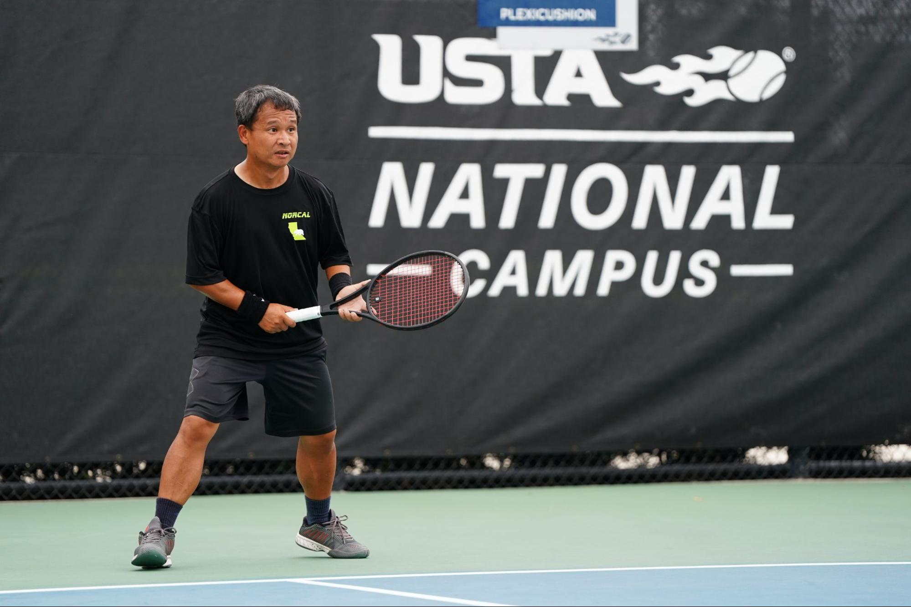

<!--truncate-->

## The Semifinal Showdown

Representing Southern California was the traditional powerhouse **Wild Cards**, led by captain Colin Tang with over 10 years of USTA experience. They arrived in Orlando with momentum, having won both SoCal 18+ 9.0 and 7.0 championships. Their roster was loaded with former National champions and finalists.

Representing Northern California was our **Royal Flush** team. A newly formed team under rookie captain Soha, we had already achieved remarkable success with three NorCal championships. Some team members had just won the 40+ 7.0 Mixed National Championship the previous week, so we should have been equally formidable.

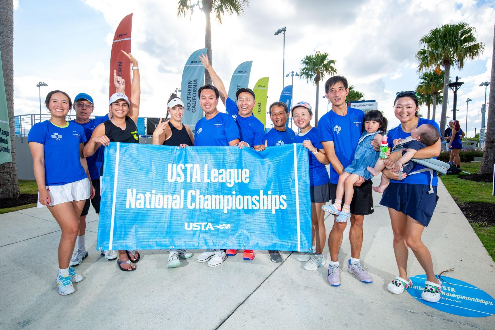

However, the process was exceptionally difficult. With planes constantly flying low overhead and their roaring sounds, tennis balls were bombarding the court like cannonballs. Austin had no resistance, getting bageled in 40 minutes. Team score: 0-1. Critical! Losing any other match would mean losing the semifinal.

Austin stared blankly at the other two courts still in play, lost in memories...

## Early Year Formation: A Strong Team Takes Shape

Our team is called **Royal Flush** - a name symbolizing unity among tennis lovers of all ages, genders, and ethnicities, coming together like brothers and sisters with loyalty and solidarity. There's also a secondary meaning: RF stands for Roger Federer's initials, hoping we could play as elegantly as him and become legendary.

Our captain Soha, though a rookie captain, was professional and hardworking. Living in the East Bay but establishing the team's home court in Palo Alto, he frequently traveled between the two, actively organizing team practices, discovering new talent, and recruiting strong players. He was also excellent at communication, motivation, and strategic lineup planning, creating exceptional team cohesion.

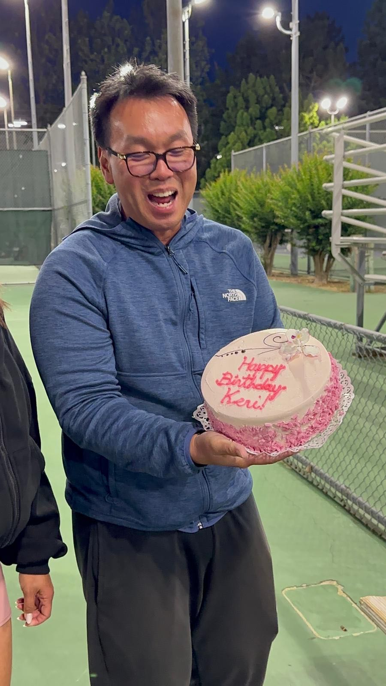

NorCal USTA was rapidly rising. Last year they won multiple National championships including 7.0 in mixed doubles, and this year championship team members had to be distributed across different teams. Post-pandemic, the Bay Area Chinese tennis community continued expanding. Hong organized various tennis tournaments, and many new talents quickly emerged. Through the captain's sincere invitations, leveraging the Chinese community while attracting strong players from different ethnicities, a powerful team quickly took shape.

## Minor Setbacks, Still Winning Sectionals

The 18+ mixed doubles league is USTA's earliest starting competition of the year and has the highest participation and enthusiasm. With strong players joining, our regular season went smoothly. Despite facing strong opponents, Royal Flush held its own, finishing the regular season 9-1 and successfully advancing through playoffs to Sectionals. Through organized team practices and regular season experience, the team's strength rapidly improved.

At the end of April Sectionals, the team competed on two fronts simultaneously - Mixed 6.0 and 7.0.

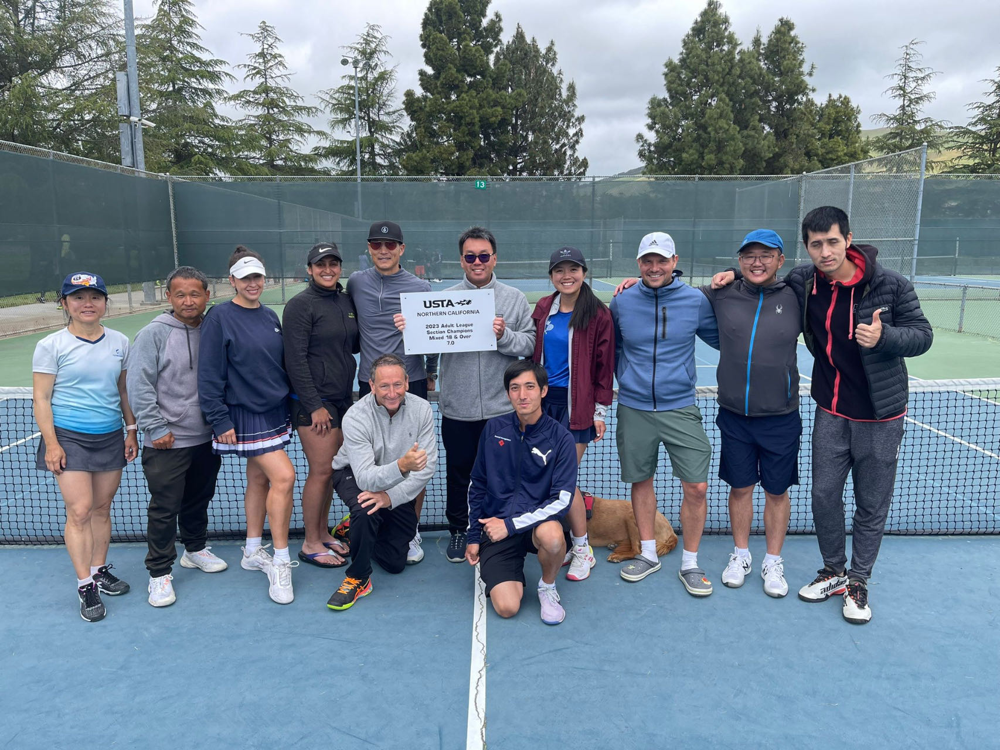
*From left to right: Amy, Austin, Vanessa, Zuhal, Bobby, Gil, Soha, Scott, Esther, Tim, Henry, Ouyang Xun*

We encountered some setbacks with several injured players unable to compete. With 6.0 and 7.0 sharing main players, lineup arrangements were stretched thin. The captain strategized to secure the 7.0 championship while competing for 6.0.

The 7.0 team went undefeated in group play. In the semifinals against last year's runner-up Morgan Hill and facing Kevin Rausa and other strong players, Amy/Tim and Gil/Esther reversed to win 3-0 in super tiebreaks, advancing to finals. The finals saw two courts winning easily for the championship. However, the personnel shortage crisis affected us for the first time and seemed to foreshadow something. The 6.0 team lost in semifinals and didn't advance.

## Relaxation and Planning for the Celebration Trip

Over the next six months, targeting Nationals, we began sustained team practices and lessons. I joined the team, spending almost every Friday evening at Cuesta team practices. But seeing so many super strong combinations on the team, I thought this Orlando trip would just be watching the excitement. Friends said Florida is the home of American tennis, and the USTA National Campus is the ultimate destination - an opportunity worth taking.

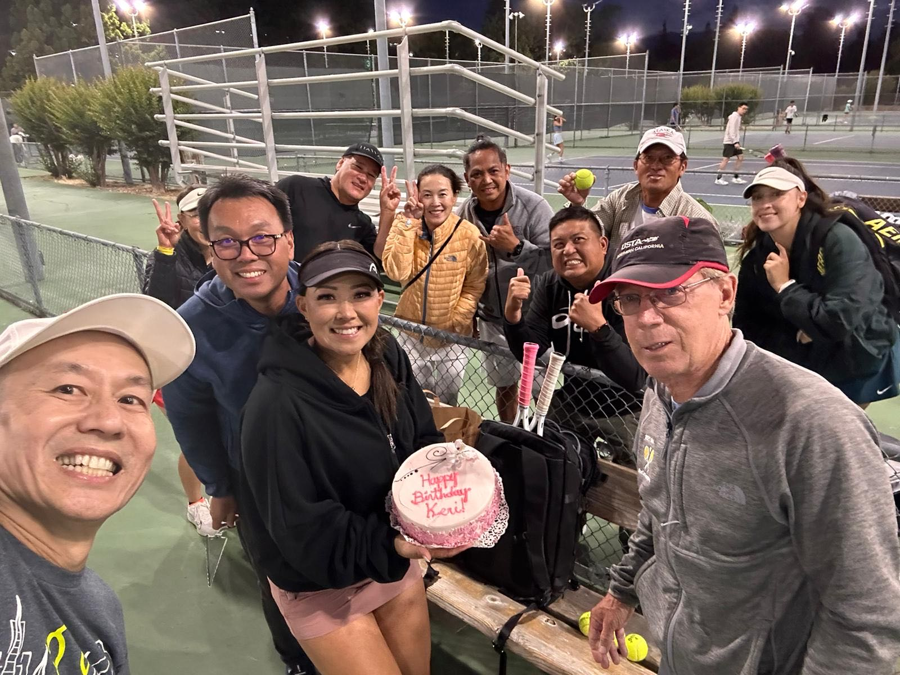

So I booked a very tight schedule: flying Thursday night midnight, arriving Friday morning, flying back Sunday night, returning to San Jose Monday morning - I could even work remotely without taking time off!

In September, the team had consecutive victories, winning 40+ mixed doubles 6.0 and 7.0 Sectional championships, also representing NorCal at Nationals. The captain assigned me to lead the 40+ 7.0 National team in early November. With strong players and reasonable lineup strategy, Royal Flush successfully won our first National championship.

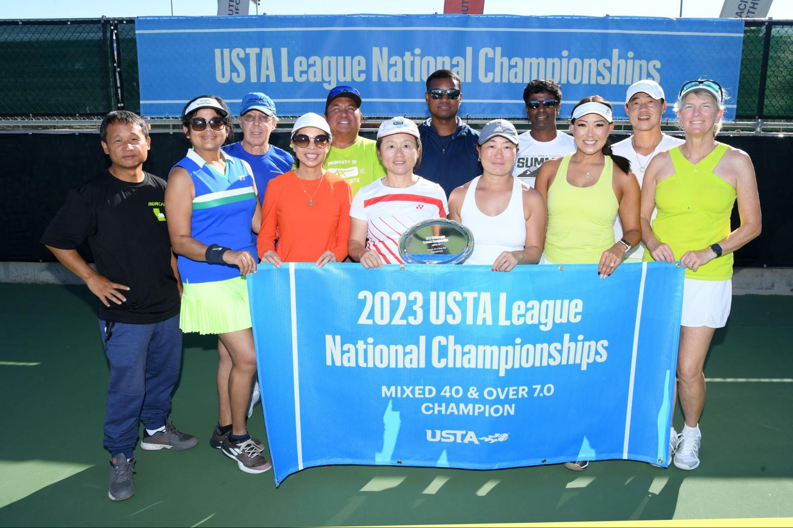
*From left to right: Austin, Mitta, Don, Lauren, Paolo, Amy, Ross, Tomami, Bala, Keri, Johnny, Judy*

As someone just "watching the excitement," I had already felt the intense atmosphere of Nationals and enjoyed the immense joy of winning a championship. Unfortunately, a key player Amy was injured during competition, creating uncertainty for the 18+ 7.0 tournament a week later, giving everyone an ominous feeling.

## Losing Players, Hastily Entering Battle

National countdown, entering the second week of November. I hadn't recovered from last week's championship excitement and was planning to coast again when the captain sent consecutive bad news.

**One week before competition:** A player was bumped to 4.5, losing Mixed 7.0 eligibility.

**Four days before:** A strong 4.0 player got COVID.

**Three days before:** Another strong 4.0 player was injured in an accident, needing several months recovery.

Losing three key players, we now had only 70-year-old Don as our sole 4.0 male player, with Scott and me (Austin) as 3.5s remaining. Fortunately I had Qualified earlier, unexpectedly becoming a must-play starter with zero mental preparation.

Misfortunes never come alone - similar situations occurred with female players:

**One week before:** Main player Amy injured, unable to walk or run.

**Two days before:** A female player got COVID.

**One day before:** Our only 3.5 Zuhal was injured during a clinic after arriving in Florida, unable to walk or run.

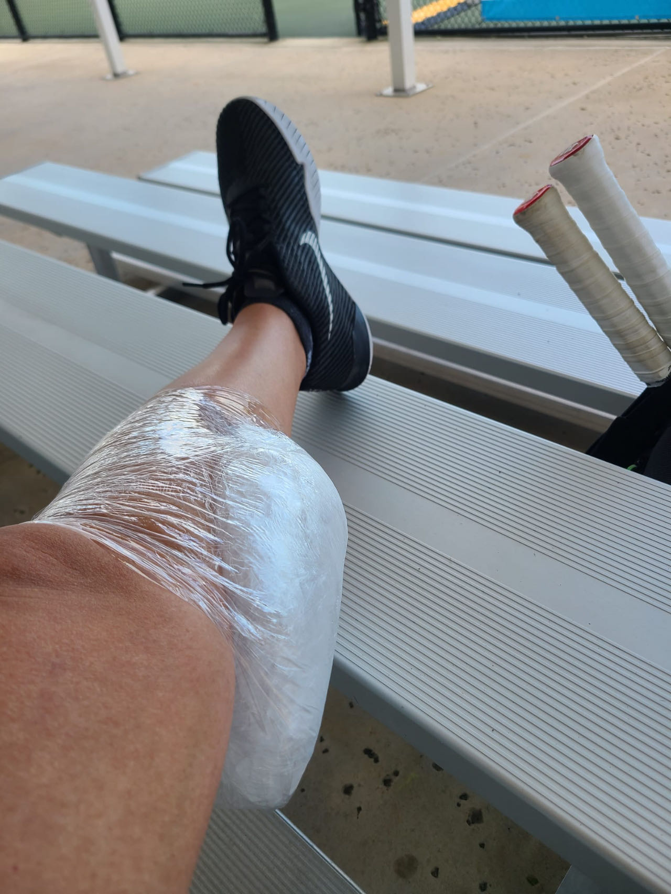

Female players were down to two 3.0 warriors Esther and Vanessa, plus injured Amy who planned to be a cheerleader. Amy realized if she didn't play, we'd have to default a court. "No way! At least I can barely run a few steps, better than Zuhal's situation."

The final traveling team included captain Soha, 5.5 players who could take the court, and 3 unable to play: Zuhal, Paul, and Tina (didn't Qualify because she played 9.0 Mixed). Just like that, the entire team was pushed to the cliff's edge - fighting with our backs against the wall!

This reminded me of another NorCal 40+ 3.5 Sectional champion team that finished last among 17 teams at Nationals. Would we repeat this humiliation? Creating the shameful history from defending champions to dead last?

No! Whatever happens, we must fight and never give up!

## Brief Introduction to USTA Nationals

USTA has seventeen sections, with sectional champions gathering for National competition. Nationals lasts 3 days with each team playing four rounds of matches against randomly assigned opponents. Rankings are determined by: wins, match victories, sets lost, and game win percentage, in that order. To rank in the top four, teams must win at least 3 rounds by large margins.

This year's 18+ Mixed 7.0 had nearly 2,000 teams nationwide with about 30,000 participants, with 16 sectional champion teams competing at Nationals. Looking at our team - we put everyone who could move on court:

- Only 1 male 4.0, 2 male 3.5s, 3 female 3.0s
- Barely assembled two 6.5 courts and one 7.0 court

This lineup was unprecedented in USTA history. Breaking through would be incredibly difficult! We'd win whatever we could!

We drew four opponents: Northern, Florida, Mid-Atlantic, and Intermountain.

## Day 1: Double Victory, Unexpected Group Leaders

November 10, Friday, 9:30 AM, facing first opponent Northern. Northern wasn't a strong section - a good warm-up opponent. Remember my tight schedule? I flew overnight, landing at Orlando airport at 6:30 AM Friday, heading straight to USTA National Campus. Upon arrival, I learned my partner was Vanessa - we'd never played a USTA match together.

**Team lineup:**
- D1: Scott + Amy
- D2: Don + Esther
- D3: Vanessa + Austin

Let me introduce my partner **Vanessa Graciano**. She restarted tennis 3 years ago, focusing on mixed doubles with incredible dedication. She joined multiple USTA teams to improve match abilities, took lessons with coaches, did team practices - could play 8 hours daily, even traveled out of state for USTA matches. Her tennis level skyrocketed in the past year.

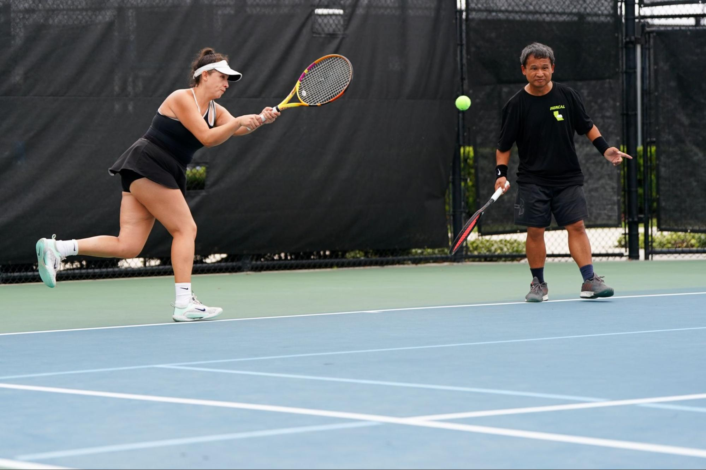

Our opponents were a 3.5 combination - the man had powerful serves and placement but poor movement, the woman liked net play but could be lobbed, and they made more errors. We won 6-1, 6-2, finishing earliest, then D1/D2 also won decisively. 3-0, team won the first round with a flying start.

First battle victory - everyone seemed to see a glimmer of hope in the gloomy clouds. Next was 1:30 PM second round against Florida, a traditional powerhouse. The captain used a strategic approach like "Tian Ji's horse racing" - our combination was weakest, placed at D1. Amy's injury limited movement, so we separated her from best partner Don, pairing her with young, mobile Scott for complementarity. We put experienced Don with young Esther.

**Team lineup:**
- D1: Austin + Vanessa
- D2: Scott + Amy
- D3: Don + Esther

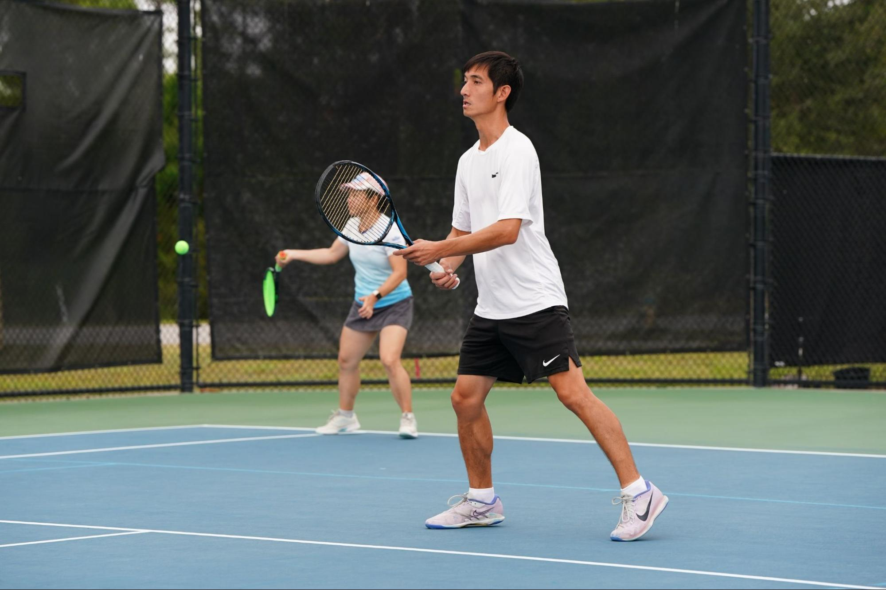

1:30 PM on time, weather very hot and humid. We faced strong challenges - both D2 and D3 fell behind early. Especially D2's opponent - young, powerful, with ATP-level serve speed and baseline forehands like bullets. Amy couldn't touch his balls, Scott was overpowered. The court filled with opponent's victory cheers.

Let me introduce **Scott Jen**. Post-pandemic USTA participant with good fundamentals and varied playing style. Actively joined Chinese community tournaments, excelling in Hecares, Zijing Cup competitions. He's strong but emotionally volatile during matches - prone to frequent errors when behind.

At the critical moment, they held firm and gradually adapted to his serve. The woman was the weakness. Scott/Amy targeted her serve game weakness and reversed 7-5 to take the first set. Down 1-3 early in the second set, they stayed calm, got bolder, broke opponent's serves consecutively. After setbacks, opponents made more errors and collapsed on court in frustration. 6-3, we won D2 - beautiful reversal!

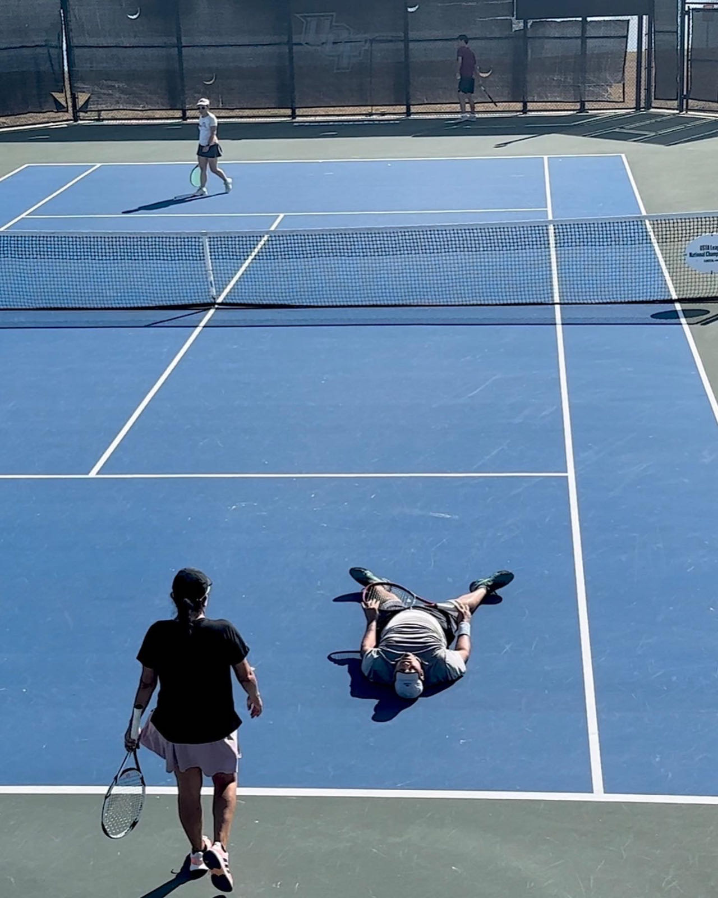

D3 also reversed. Under Don's experienced leadership, despite a rough start, they quickly found opponent weaknesses, reversed 7-5 in the first set, then easily took the second. 2-0, team won.

But that wasn't enough. To rank top four, we needed to win as many courts as possible. Focus shifted to D1. Our opponent's man was named Jose - we're from San/Sheng Jose, could we triumph over Jose? Surprising start - we broke serve and led 3-1, but good times didn't last. Opponent broke back to tie 5-5, then broke again to hold, we lost the first set 5-7.

Second set we made changes, swapping positions - I took Court 1 forehand side to use aggressive forehand returns, Vanessa took Court 2 backhand side to utilize her sharp backhand and net finishing. Indeed, we got stronger - 6-4 tied the match 1-1. In the super tiebreak, after tying, Vanessa surged with a sharp baseline backhand down-the-line pass to start, scoring consecutively. I finished with a powerful straight return that went out - in less than ten minutes, we cleanly took the tiebreak 10-1. 3-0, we completed the upset against the powerhouse.

Day 1 ended - two beautiful 3-0 sweeps, unexpected delight. Among 16 teams, we ranked first!

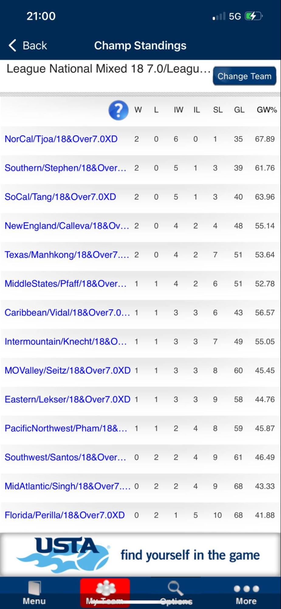

I rushed back to the hotel to sleep. From 6:00 AM the previous day, through 9 hours work, 9 hours travel, 9 hours on court - a full 31 hours later, I could finally sleep. Other teammates celebrated the first day's victory at a boba shop!

## Roller Coaster Ride: Narrowly Advancing Through Danger

Day 2, November 11 - today is Singles Day (11/11). Could we sweep like everyone's aggressive shopping on Singles Day?

First opponent: **Mid-Atlantic**. They had already lost to SoCal and Intermountain on Day 1, eliminated from contention. With our two Day 1 wins, we were confident, assuming they'd field more substitutes and we could easily beat them. We used our normal lineup:

**D1:** Scott + Amy
**D2:** Don + Esther
**D3:** Vanessa + Austin

Match delayed one hour due to fog, starting at 10:30. No surprise - they still fielded their strongest lineup, same players who faced SoCal yesterday, just slightly different order. We learned later that SoCal barely beat them 2-1 with two super tiebreaks and close scores - similar strength. We underestimated them.

A harsh wake-up call - our easiest winning combination from yesterday, Don/Esther, quickly lost 1-6, 4-6 to opponents. Team down 0-1, we had to win both remaining courts to prevail. Unfortunately, both courts went to super tiebreaks. Started poorly, both opponents jumped to quick 5-0 leads, and both tiebreaks were lost. Team swept 0-3. Indeed, Singles Day is for sweeping - we got swept!

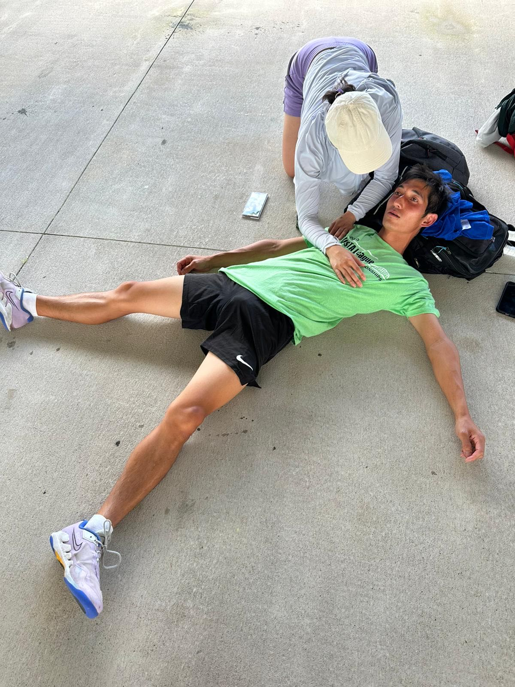

After three rounds, team record 2-1, individual courts 6-3, we ranked 4th. Though our fate remained in our own hands, competitors were numerous - 5 teams also 2-1. The final round HAD to be 3-0 to ensure top four advancement!

Final round opponent: **Intermountain**. Yesterday they beat Mid-Atlantic, and though they lost to SoCal this morning, eliminating top-four hopes, they were strong. Our hearts trembled.

Lineup strategy became crucial, and lineup can't work without knowing opponents. Let me introduce our chief scout **Paul Chen** - veteran USTA captain with 10+ years experience, former 4.5 standout. Though he didn't Qualify for Nationals due to insufficient regular season matches, he still came to USTA National Campus, and proved invaluable.

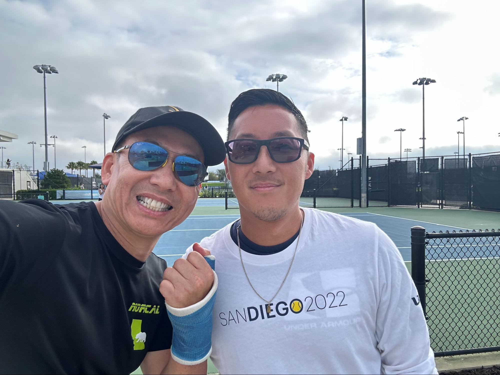

While we faced Mid-Atlantic, Paul busily recorded Intermountain vs SoCal matches, capturing video segments of each court, analyzing each player's strengths/weaknesses, comparing with our team combinations. He provided precious firsthand intel for captain's lineup decisions.

Paul was also our chief photographer, cheer captain, driver, and coach. He partnered with me to win the Hecares Gold Division doubles championship, reversing three super tiebreaks across four rounds, producing a quantum leap in my match ability (technique and mental game). These experiences hugely helped winning at Nationals.

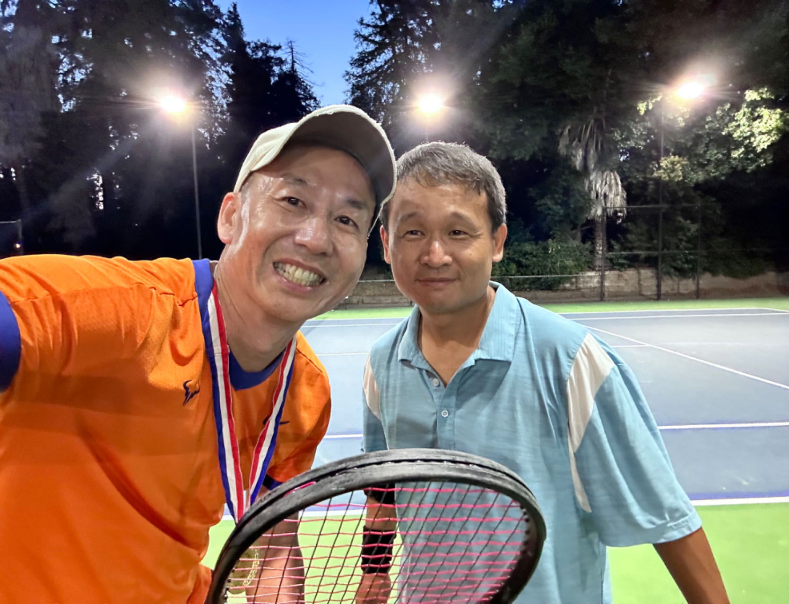

Based on Paul's intel and their previous lineups, Captain Soha determined our court order:

**D1:** Don + Esther
**D2:** Scott + Amy
**D3:** Vanessa + Austin

This was our strongest possible lineup. All-in! Fight for survival!

2:00 PM, Sunday afternoon, match started on time. From the beginning, we aggressively attacked. D2 Scott/Amy and D3 Vanessa/Austin both broke serve early and led. But D1 faced strong opponents - their woman player had beaten Amy last week at 40+ 7.0 Nationals. Despite Don's experience, facing a former 5.0 player now rated 4.0, combined with the strong female player, they struggled. First set lost 3-6, second set down 2-4, in danger of losing.

I tried focusing on my own match but couldn't help glancing at D1's score - they were being dominated! My heart ached. If D1 lost, even if D2/D3 won, we'd only get 2-1, not guaranteed top four. Plus both our courts were close - could fall behind anytime.

The tense moment arrived. My court reached 5-5 in the first set, Scott's court 4-4. Meanwhile Don/Esther were down 2-5 in the second set, one game from defeat. Three courts in crisis simultaneously!

**The miracle happened!**

Don/Esther fought back - breaking serve twice consecutively, dragging to 5-5! Then holding serve 6-5, forcing a tiebreak! The tiebreak was tight, they fell behind 4-6, facing two match points!

At this moment, other courts also tensed up. My court was 6-5, Scott's 5-4 - all three courts in the balance!

Don/Esther saved the first match point - opponent's overhead went long. Then saved the second - opponent netted a volley. From 4-6 they tied 6-6, then 7-6 - match point for us! Opponent made an unforced error - WE WON! They reversed the second set tiebreak 8-6, match tied 1-1!

This inspired the entire team! Scott/Amy quickly won their first set 6-4. My court also won first set 6-3.

Super tiebreak started - Don/Esther jumped to a 5-1 lead, but opponents fought back to 5-5. Critical moment, Don placed a perfect volley winner, 6-5. Then another winner, 7-5. Opponent's error, 8-5. Finally Esther's overhead smash - 10-6! They won the super tiebreak!

**First court secured: 1-0!**

Scott/Amy's second set went smoother - 6-2, they won 2-0!

**Second court secured: 2-0!**

Now all pressure on my court. First set won 6-3, but second set turned intense. Both sides held serve until 5-5. My serve game - I went up 40-15, two points from victory. But opponent fought back, we went to deuce multiple times. After five deuces, I finally held - 6-5, serving for the match!

Receiving serve, opponent fought desperately. 15-15, 30-30, deuce... The game wouldn't end. After multiple deuces, Vanessa hit a perfect return winner down the line - break point! I charged the net, opponent tried passing shot - Vanessa volleyed it away!

**GAME, SET, MATCH!**

We won 6-3, 7-5! No super tiebreak needed!

**Third court secured: 3-0!**

**Team swept Intermountain 3-0!**

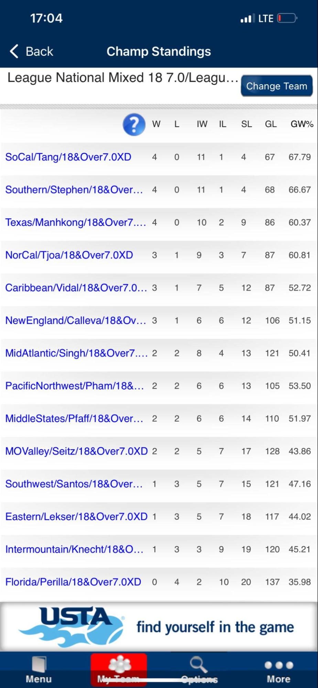

## A Thrilling Semifinal: Lead Slips Away

*”Super tiebreak!”* — the startled exclamations around me snapped me out of my memories. When I refocused, the air around us was so thick with tension it was almost suffocating. I should introduce our opponents:

- **D1:** Don + Esther vs. Priscilla/David Lui (D1 mainstays of the 3.5 National runner-up team)
- **D2:** Vanessa + Austin vs. Mariam/Anthony (strong 4.0 male who also competes in 7.0/9.0 National Mixed)
- **D3:** Scott + Amy vs. Jin/Lauren (strong 4.0 female; main players on last year’s National Mixed 8.0 championship team)

On D2, Anthony — who also plays 9.0 — had already dismantled us completely. The super tiebreak now underway was D1. Don and Esther had taken the first set with surprising ease at 6-1, but the second set turned on a dime: opponents returned the favor 6-1. In the super tiebreak they fell behind throughout, but at the critical moment Don’s experience and Esther’s fearless fighting spirit pulled them through — 10-8, tying the team score at 1-1.

Let me introduce **Esther Chen** — a sweet, somewhat shy young player who started competing in USTA this year. She began with almost no match experience, but rapidly developed through Royal Flush’s team practices and competitions. Her backhand groundstrokes are now solid and her net overheads are sharp. After Amy’s injury, she stepped up as the team’s top female 3.0. She had just won the 18+ 3.0 Women’s National Championship.

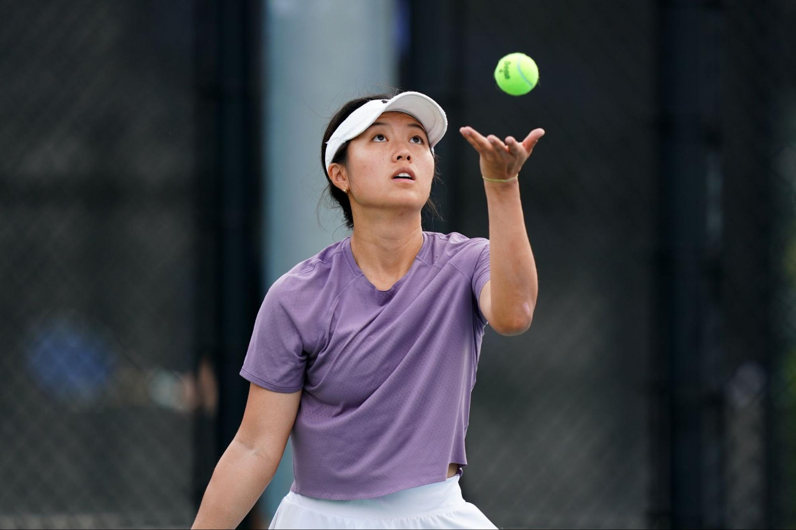

All eyes shifted to D3. Opponent’s 4.0 female Lauren was very aggressive at net; 3.0 male Jin played with the power of a 4.0 male, with solid groundstrokes — the two had gone undefeated in all four previous matches. Scott/Amy took a 3-0 lead in the first set, but opponents clawed back and won the tiebreak. Now deep in the second set, Amy’s injury was clearly affecting her play, and Scott was running on empty, his Achilles tendon quietly aching. 4-3, Amy serving — hold here and the second set was theirs. 30-0, looking smooth. 40-15, one point away. But Scott at the net rushed his shots and made consecutive errors: broken, 4-4.

The second chance arrived — Lauren was visibly nervous, making consecutive serve errors. Broken: 5-4. Scott serving for the match! Every NorCal and SoCal player and family member was on their feet cheering. Tina, who had just finished winning bronze in the Mixed 9.0 3rd/4th place match, rushed over to join the rally. I was too anxious to watch and stepped away to the restroom. When I came back, I heard the deflated sighs — Scott couldn’t hold his serve, 5-5. Opponents then held and broke to take the second set. D3 lost. SoCal advanced to the final.

Six players who had played all five matches — everyone had given everything they had, nearly spent.

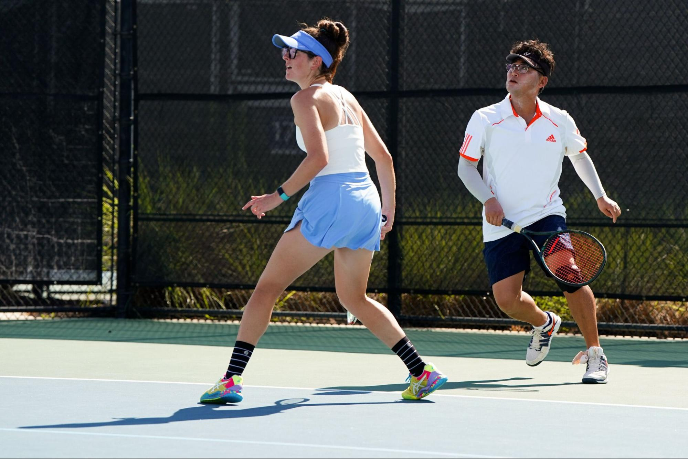

## Bronze Medal Battle: A Legendary Partnership’s Final Act

But the competition wasn’t over. We still had the 3rd/4th place match — and we wanted the best result possible.

Our opponent was Southern, who had finished 2nd in the round-robin, losing only to eventual champion Texas in the semifinal. Seeing that Southern consistently put their strongest combination at D1, Captain Soha deployed a “Tian Ji’s horse racing” strategy — deliberately mismatching positions to gain a favorable edge:

- **D1:** Vanessa + Austin
- **D2:** Scott + Esther
- **D3:** Don + Amy

This lineup also gave Don and Amy the opportunity to play one final National 7.0 match together before Amy moved up to 3.5.

Let me properly introduce the **legendary partnership of Don and Amy**. Don Scettrini was a USTA 5.0 in his youth and is now rated 4.0, with extraordinary USTA experience: over 20 National appearances, 5 championships. Remarkably consistent, a lefty who can place the ball precisely anywhere on the court when under pressure, and reliably converts advantages into points when ahead. **Amy Yang** is an accomplished amateur badminton player with impressive tournament results. She took up tennis after COVID and began playing USTA last year — not long, but she improved at a remarkable pace. Her hallmarks: incredible consistency, mental toughness, solid at the baseline, aggressive at net, and tactically versatile.

Since first partnering with Don in January the previous year, the two became unstoppable. Together they dominated Mixed 7.0 across 18+ and 40+ leagues — partnering 37 times in regular season, playoffs, Sectionals, and Nationals (including 16 National matches) — 31 wins, 5 retirements (because the team had already clinched), and only one loss. They claimed the 2022 40+ 7.0 National championship, the 18+ 7.0 National championship, and the 2023 40+ 7.0 championship — **three consecutive titles**. Amy also won the 18+ 3.0 Women’s National Championship just weeks prior.

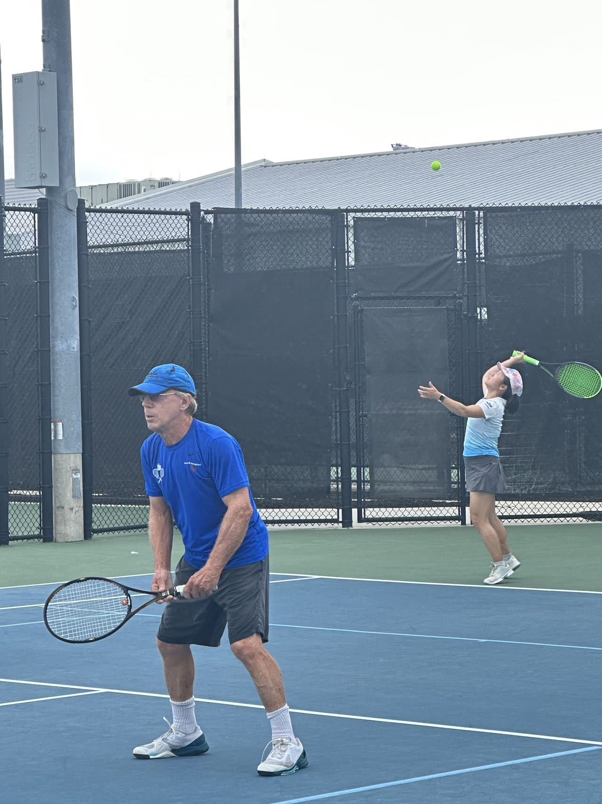

As expected, once play began, Don and Amy moved in perfect sync — dismantling their opponents with back-to-back 6-2, 6-2 wins. Team score: 1-0.

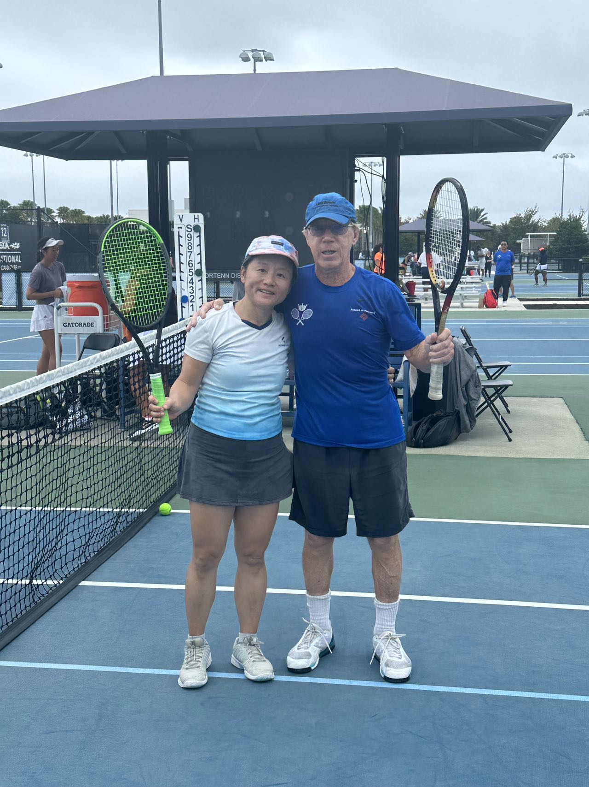

Then — no miracles for us — Vanessa and I lost to the opponent’s D1 sibling duo. Tied 1-1. All eyes moved to D2: the young combination of **Scott and Esther**, who would decide which team went home with bronze.

Evenly matched. First set, Scott/Esther took it in a tiebreak. Second set, opponents evened it up 6-4. Super tiebreak — another super tiebreak. The painful memory of the Mid-Atlantic super tiebreak loss was still fresh. Would history repeat?

Fortunately the start was smooth: 4-1... 7-4... 9-6 — **three match points**. Then Scott’s volley caught the net. Esther’s overhead flew long. 9-8. Opponents serving — hearts in throats.

After a few exchanges, Scott hit a beautiful crosscourt volley winner to seal it. We held on. **We won.** The entire court erupted.

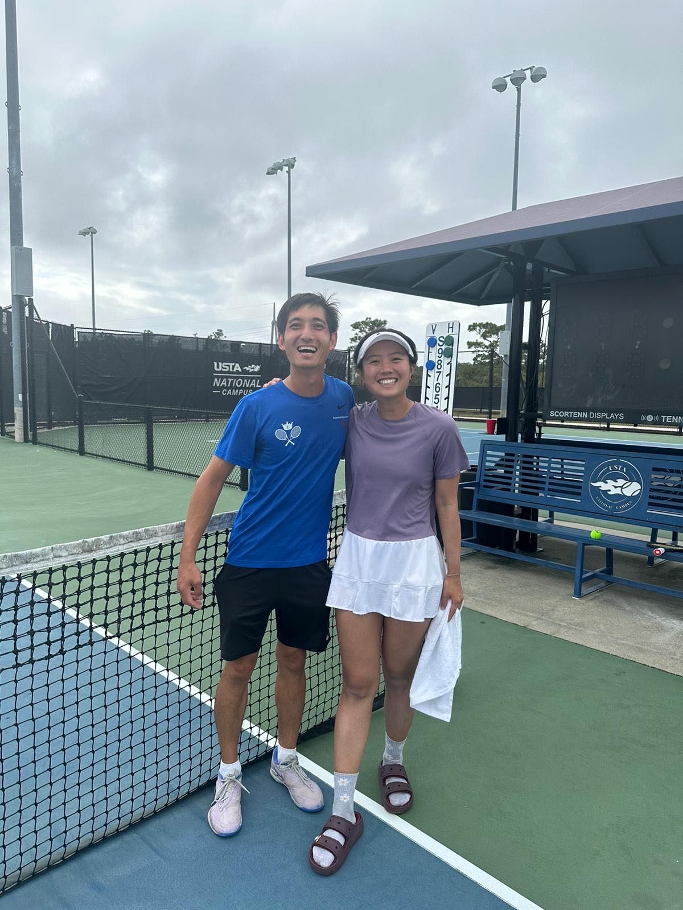

Royal Flush’s 18+ Mixed 7.0 National journey was complete. Six players. Three days. Six matches. Obstacle after obstacle, fighting with everything they had until completely spent — and in the end, a hard-won bronze medal that will never be forgotten.

## Awards and Acknowledgments

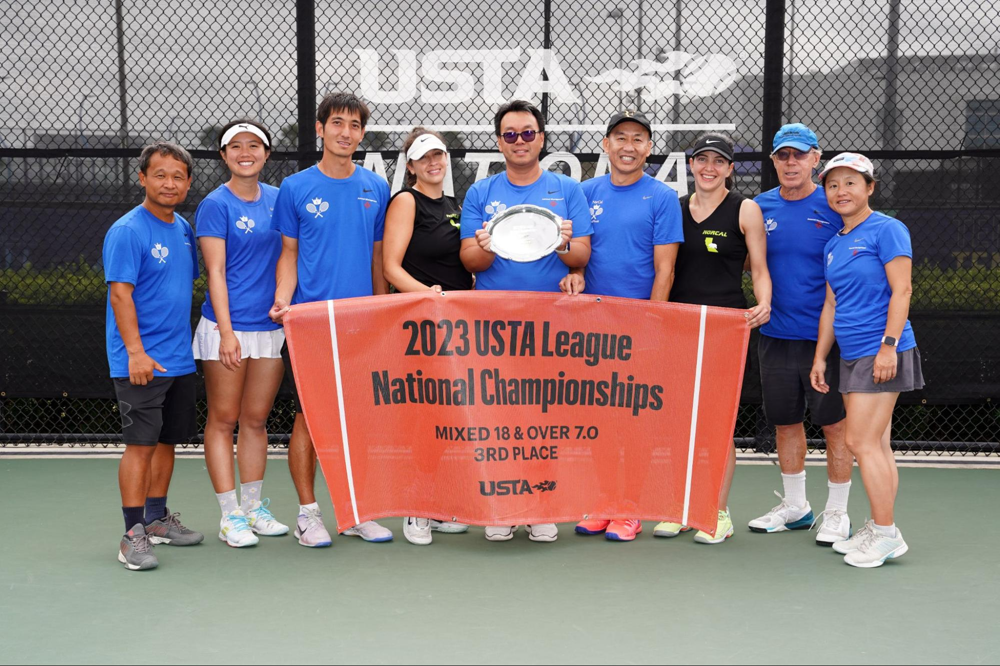

*From left to right: Austin, Esther, Scott, Vanessa, Soha, Paul, Tina, Don, Amy*

Here are the captain’s words of thanks:

> Congratulations to the Royal Flush team in winning 3rd place at the 2023 18+ 7.0M USTA Nationals, representing NorCal in Orlando. I want to congratulate and thank all the players that have given their 150% in competing for every intense match on the court. And thanks to all the supporters who have given their cheering and positive energy for the team. Without any of your presence — both players and supporters — we won’t be able to make it this far. So thank you 🙏
>
> We were left with only 6 players, none of them in top condition and some still injured. Regardless, these 6 warriors stood up and fought in 6 intense matches across 3 days in Florida’s hot and humid weather. Despite all odds, we still made it to 3rd place at the 2023 18+ 7.0M USTA Nationals — out of approximately 2,000 teams and 33,000+ players. As the captain, I couldn’t have asked for more, and I am very proud of the team. We have already made history in USTA for these reasons:
> - Only 6 players (in diminished condition) competed in all 6 intense National matches
> - Two 3.5/3.0 (6.5) lines and one 4.0/3.0 (7.0) line throughout all 6 matches
>
> As the captain of Royal Flush, I don’t need a plate or banner to show our team is a champion. We were already champions when we made it to the semifinals in our condition. I am so proud of you all — thank you for the determination and hard work that created such precious and unforgettable memories together.

And the heartfelt farewell words from our legendary partners, Amy and Don:

> **Amy:** I want to thank Don for carrying me through this two-year partnership. I have been extremely lucky to partner with Don the Master for my first USTA match and then 36 more afterwards. As a tennis newbie, I learned so much from Don — every match felt like a private lesson. We don’t talk a lot on the court, but the chemistry is always there 😂. Don is a legend, a role model, a rock in every match. What an unforgettable journey! Thank you, Don Scettrini!

> **Don:** Thank you, Amy Yang, for partnering with me these past 2 amazing years. You are the common denominator in all the winning partnerships you’ve had since you started playing USTA. You are the ideal partner — you learn so quickly and have adapted to the different playing styles of every partner. Your mental toughness and warrior mentality take you to the next level. You never give up and keep pushing to victory even with injuries. I’ve been so lucky to have partnered with you and will cherish our memories together. You will certainly have success at 8.0 with any partner.

This golden 7.0 mixed doubles partnership has run its course for now — but their rich experience, sportsmanship, and team spirit brought cohesion to the team and set a wonderful example for newer players. They are exactly the kind of teammates every captain hopes to have.

## Postscript

On the same day, a few hours later in San Diego, the Royal Flush 40+ 6.0 Mixed team — directed behind the scenes by Soha and led on court by Christy — defeated an Eastern powerhouse to claim the 40+ 6.0 Mixed National Championship. With USTA Nationals now concluded, Royal Flush finished the year with two National championships (40+ 6.0 and 7.0), a National bronze (18+ 7.0), and also helped the 18+ 2.5 Women’s team earn a National bronze — a richly rewarding season all around. We welcome strong players of all backgrounds to join our team and chase even greater achievements in the year ahead.
