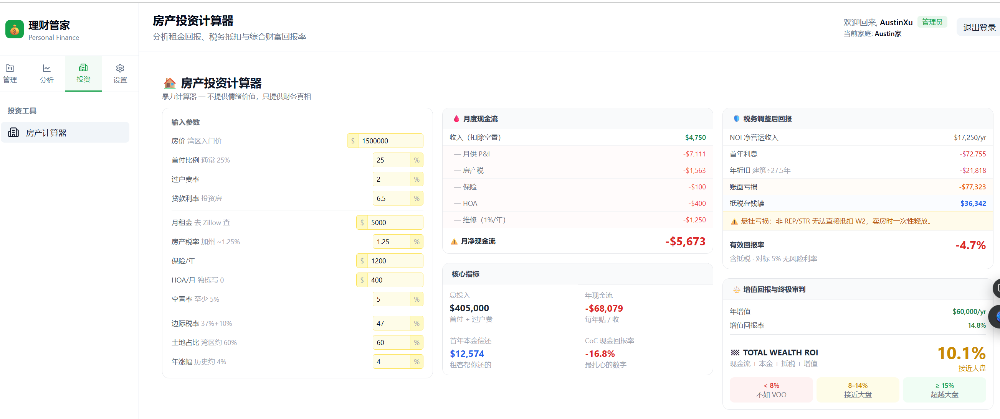

*This is an extended chapter to the [6-part Claude Code series](/blogs/blog/tags/claude-code). The first six chapters documented building a full-stack Finance app using Vibe Coding. This chapter covers what came next.*

After accumulating 40,000 lines of code with Vibe Coding, a structural problem surfaced:

> **AI writes code fast. AI also goes off-track fast.**

One vague sentence in, AI understands 70% of the requirement and sprints full-speed for two hours — then you realize the core logic is wrong and have to start over. This chapter documents switching to **Spec-Driven Development (SDD)** using **OpenSpec**, completing three production features, and measuring the difference.

<!--truncate-->

## The Pain Points That Forced the Change

Before adopting SDD, these problems kept recurring in the Finance project:

- **No upfront design**: AI jumped straight to implementation, architectural issues only surfaced after the fact
- **AI drift**: without clear task boundaries, a vague requirement could produce wildly different code quality across sessions
- **Tests routinely skipped**: Vibe Coding defaults to "get it running first," tests become optional
- **Slow debugging**: back-and-forth with AI was inefficient when there were no clear task boundaries to anchor the conversation

## What is Spec-Driven Development

The core principle: **reach consensus before writing code**.

In Vibe Coding, the flow is:
```
Idea → One-liner prompt → AI starts coding → Iterate as you go
```

In SDD, the flow is:
```
Idea → Structured proposal → Task checklist → AI implements by checklist → Archive spec
```

The difference isn't the tooling — it's **when decisions are made**. SDD forces all important decisions (feature scope, technical approach, acceptance criteria) to happen before coding begins, locking them into documents that constrain AI to execute within a well-defined space.

## OpenSpec: The Tool

OpenSpec is a lightweight CLI built specifically for SDD. Its project structure:

```
openspec/
├── specs/           # Current full spec (source of truth)
│   └── <capability>/
│       └── spec.md
└── changes/         # In-progress changes
    ├── <change-id>/
    │   ├── proposal.md   # Why, what, and scope
    │   ├── design.md     # Technical approach
    │   ├── tasks.md      # Decomposed implementation checklist
    │   └── specs/        # Delta spec (additions/modifications only)
    └── archive/          # Completed and archived changes
```

```bash
npm install -g @fission-ai/openspec@latest
cd your-project
openspec init
```

## The Three-Phase Workflow


OpenSpec is used in Claude Code via three Skills:

### Phase 1: `/opsx:propose`

Input: A one-sentence requirement
Output: `proposal.md`, `design.md`, `tasks.md`, delta `specs/`

This transforms a vague idea into an **executable contract**. AI acts as architect and product manager; you act as reviewer. The most important thing to check: is `tasks.md` decomposed reasonably, and are acceptance criteria clear? **Fixing issues here is far cheaper than tearing things apart mid-implementation.**

### Phase 2: `/opsx:apply`

Input: Reviewed and approved `tasks.md`
Output: Code, tests, and configuration implemented task by task

AI executes in order, marking each `[x]` on completion. You can pause, review, correct direction, and resume. Key discipline: **don't insert new requirements during implementation**. If requirements change, update the proposal first, then resume apply.

### Phase 3: `/opsx:archive`

Input: Completed change directory
Output: Delta spec merged into `openspec/specs/`, change moved to `archive/`

This keeps the spec library always representing "the current state of the system" — the starting point for every subsequent change.

## config.yaml: The Most Important Investment

After Feature 1, I realized I'd skipped a critical setup step: `openspec/config.yaml`. This is OpenSpec's equivalent of `CLAUDE.md` — it tells AI about the project's tech stack, coding conventions, and historical mistakes to avoid.

**Initializing it:**

```
Please update the config.yaml under the openspec directory. Refer to the root CLAUDE.md
for tech stack, conventions, and code style guidelines. Refer to README.md for domain
knowledge. Use the example format provided in the config.yaml file.
```

**The key practice — write every mistake into it:**

```
When developing the runway feature with OpenSpec, two mistakes were made:
1. Currency was ignored — account amounts were summed directly without conversion
2. The fix introduced a performance issue — exchange rates were queried from DB
   per record, when the Controller layer already has a cached ExchangeRateService

Please add these to config.yaml so future changes avoid repeating them.
```

> **config.yaml isn't a one-time setup — it's an ever-growing error prevention manual.** Each mistake gets added; AI proactively avoids it in every subsequent change.

This is the biggest behavioral difference between SDD and Vibe Coding. Vibe Coding mistakes leave traces only in git history and tend to recur. SDD mistakes get distilled into structured rules — they become the project's "error prevention DNA."

## Three Features in Practice

### Feature 1: Runway Analysis

**Requirement**: Based on current liquid assets and projected monthly expenses, calculate how long the family's funds will last.

AI generated a checklist of 27 tasks covering backend API, frontend pages, and tests.

**Bugs surfaced during Apply:**

*Issue 1 — Currency not aligned*: The implementation simply summed all account balances, ignoring multi-currency. A USD account and a CNY account added directly, producing completely wrong results. This was a business understanding gap, not a technical one. AI writes code quickly but doesn't spontaneously "think about" currency conversion.

*Issue 2 — Every exchange rate lookup hit the database*: When fixing the currency issue, AI queried the database for exchange rates per record, making report generation extremely slow. The system already had a cached `ExchangeRateService`. Both bugs were fixed quickly after pointing them out — and both were written into `config.yaml`.

**Stats**: ~1,900 lines, 26/27 tasks, ~**2 hours**

---

### Feature 2: Runway Report Persistence and PDF Export

**Requirement**: The Runway page recalculates from scratch every time. Save snapshots for later review.

This feature went through three requirement changes — a good test of SDD's flexibility:

```
Initial: Export JSON file to local disk
↓ JSON was unfriendly
Change 1: Export as PDF report instead
↓ Changed mind — don't want local-only storage
Change 2: Persist to backend database, add report list page
```

The third change shifted scope from "pure frontend" to "full-stack with new database table." OpenSpec detected the large scope change and **deleted the already-generated proposal and tasks to regenerate from scratch**.

This is SDD discipline: **when requirements change significantly, re-propose — don't patch a half-baked proposal.** Experience proved this right. In prior Vibe Coding work, piecemeal modifications to half-formed requirements consistently confused AI and produced worse results.

The regenerated proposal produced 34 tasks across 11 categories (backend entity/Repository/Service/Controller, frontend components, database migration, backend tests, frontend tests).

**Stats**: ~1,800 lines, 33/34 tasks, ~**38 minutes** (from second proposal to archive)

---

### Feature 3: Property Investment Calculator

**Requirement**: Convert an Excel spreadsheet ("The Brutal Calculator") into a native web calculator for Bay Area high-income earners to evaluate after-tax returns on rental property investments.

```
I added an Excel file under the requirement folder (The Brutal Calculator.xlsx).
Please read the sheet and convert it as a new feature: Property Investment Calculator.
```

AI fully parsed all formula logic and generated 22 tasks across 8 groups — a purely frontend change with no backend or database modifications.

**Problem during Apply**: PMT (mortgage payment) and CUMPRINC (principal paydown) formulas were implemented incorrectly. Fixed after pointing it out. This reflects AI's imperfect understanding of financial formulas, not a code capability issue.



*13 editable inputs on the left, five real-time result panels on the right*

**Stats**: ~2,400 lines, 19/20 tasks, ~**49 minutes**

---

## Side-by-Side Comparison

| | runway-analysis | runway-report | property-calculator |
|---|---|---|---|
| **Code added** | ~1,900 lines | ~1,800 lines | ~2,400 lines |
| **Task count** | 27 | 34 | 20 |
| **Complexity** | Full-stack, no new DB table | Full-stack + new DB table | Frontend only |
| **Critical errors** | Currency alignment, rate perf | API routing, PDF encoding | Financial formula errors |
| **Dev time** | ~2h | ~38m | ~49m |

**Why were Features 2 and 3 so much faster than Feature 1?** Not AI getting smarter. Three reasons:

1. **config.yaml accumulated lessons** — currency/exchange rate issues written in after Feature 1; Features 2 and 3 didn't repeat them
2. **Test infrastructure was in place** — Vitest set up after Feature 1; subsequent features built on it directly
3. **Clearer proposals** — after the first feature, requirements were more precisely specified, reducing AI interpretation errors

## SDD vs. Vibe Coding: When to Use Which

| Dimension | Vibe Coding | Spec-Driven Development |
|---|---|---|
| **Requirement clarity** | Fuzzy is fine | Need to think through scope upfront |
| **Feature complexity** | Small (< 5 files) | Medium to large (cross-layer, multi-task) |
| **Drift risk** | High | Low (task checklist constrains direction) |
| **Flexibility** | Change direction anytime | Update proposal before continuing |
| **Traceability** | Git history only | Full record in proposal/tasks |
| **Best for** | Prototyping, exploratory work | Deliverable features with acceptance criteria |

**The practical rule:**

> Use **Vibe Coding** to validate ideas. Use **SDD** to deliver features.

Specific decision criteria:
- ✅ Change touches 3+ files → use SDD
- ✅ Requires both frontend and backend changes → use SDD
- ✅ Includes database schema changes → use SDD
- ⚡ Quick UI tweaks, small bug fixes → Vibe Coding is enough

## Key Takeaways

**Three things that actually mattered:**

**1. config.yaml is the highest-ROI investment**
Spend 30 minutes before writing any code putting the project's tech stack, conventions, and known mistakes into config.yaml. Returns compound with every subsequent feature.

**2. When requirements change significantly, re-propose**
Feature 2's three-round requirement changes proved this. When scope shifts more than ~50% from the original proposal, starting over is faster. AI works efficiently in clear context; in muddled context, it makes strange decisions.

**3. Write every mistake back into config.yaml**
This single habit separates SDD from Vibe Coding in practice. Mistakes become rules; rules become institutional memory.

**Quantified results across three features:**

- Code added: ~**6,100 lines**
- Tasks completed: **78/81**
- Total development time: ~**3.5 hours**
- Average per 100 lines: ~**3.5 minutes**

Feature 1 (~2 hours) included the learning curve and building config.yaml. Features 2 and 3 combined (~87 minutes, ~4,200 lines) represent actual SDD velocity once the workflow is established.

---

## References

- [OpenSpec on GitHub](https://github.com/Fission-AI/OpenSpec)
- [OpenSpec Introduction](https://jimmysong.io/zh/book/ai-handbook/sdd/openspec/)
- [OpenSpec vs SpecKit in Depth](https://juejin.cn/post/7605494530017165352) *(Chinese)*
- [Finance Project Source Code](https://github.com/austinxyz/finance) — includes CLAUDE.md, Skills, and openspec configuration
