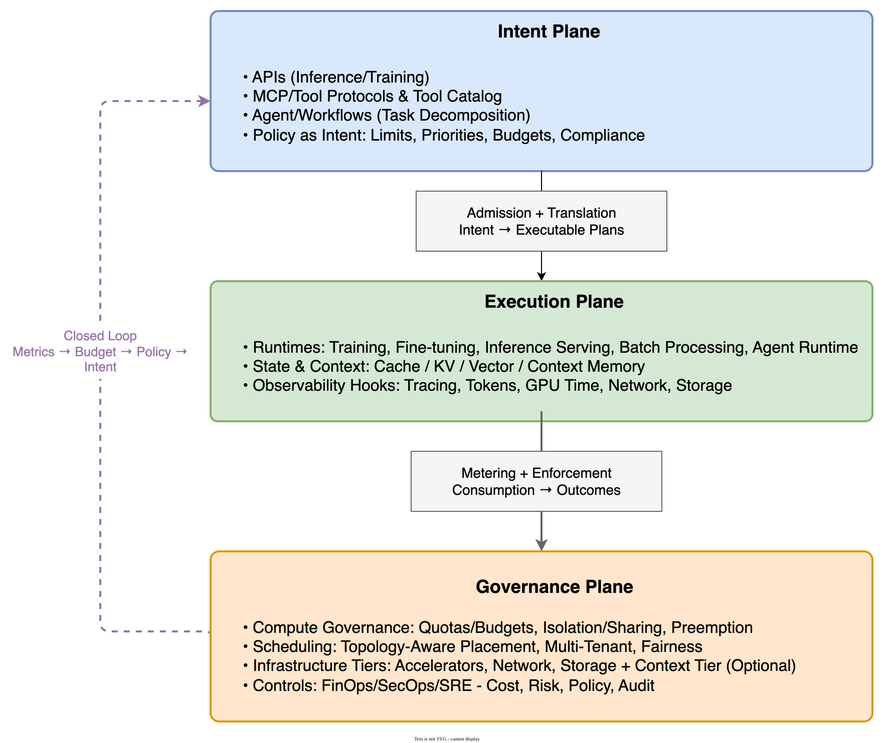

*This is Part 2 of a two-part series. [Part 1](/blog/cloud-native-to-ai-native-infra) covers the infrastructure layer — GPU clusters, schedulers, and hardware platform management. This post covers the application platform layer: what it means to build a platform that treats Agents as first-class runtime objects.*

---

In the late 1800s, when electric motors arrived in factories, most factory owners did the obvious thing: they removed the steam engine in the basement and dropped an electric motor in its place. Same shafts. Same belts. Same building layout. For thirty years, productivity barely improved.

The motor wasn't the problem. The belts were.

The real breakthrough came when a new generation asked a different question: if every machine can have its own motor, why do we need belts at all? Without belts, factories could reorganize around the flow of work rather than the flow of power. The result was transformative — not because the motor was better than the steam engine, but because removing the constraint unlocked an entirely different architecture.

[Sri Shivananda's recent piece](https://srishivananda.substack.com/p/are-we-plugging-the-future-into-the) uses this analogy to describe what's happening with AI adoption today. We have the motor. But most organizations are keeping the belts — plugging AI into existing ticketing workflows, existing PR queues, existing stage-gated planning cycles. The AI works. The surrounding system neutralizes it.

<!--truncate-->

I've been thinking about this through the lens of platform engineering. When I led application platform work during the Cloud Native era, the job was to abstract away infrastructure complexity and give application teams a stable, self-service surface. Now, with AI-native applications, I'm asking the same question in a new context: what does a platform need to provide for the next generation of workloads?

The answer, it turns out, requires dismantling some very comfortable belts.

---

## What Cloud Native App Management Actually Was

It's worth being precise about what "application platform" meant in the Cloud Native era, because the contrast with AI Native is sharper when you're specific.

Cloud Native app management was fundamentally about **lifecycle and traffic governance for deterministic services**. The platform provided:

- **Service lifecycle**: deployment pipelines, rolling upgrades, health checks, rollback triggers
- **Traffic control**: L7 routing, canary releases, circuit breaking, mTLS between services
- **Multi-tenancy**: namespace isolation, resource quotas, RBAC policies
- **Observability**: distributed tracing, error rate dashboards, SLO-based alerting
- **Self-service**: application teams could deploy, scale, and configure without waiting on the platform team

The implicit contract was simple: **you give us a container, we give you reliable, observable execution**. The workload was a black box. We didn't need to know what it did — only that it started, served traffic, and could be restarted safely.

That contract is the belt.

---

## What AI Native Apps Actually Look Like

Cloud Native applications are deterministic. Given the same input, they produce the same output. You can write a test, run it in CI, and trust that green means correct.

AI Native applications — specifically anything involving agents, RAG pipelines, or LLM-backed workflows — are fundamentally different across several dimensions that matter for platform design:

| Dimension | Cloud Native App | AI Native App |
|-----------|-----------------|---------------|
| **Execution unit** | Service responds to request/response; behavior is predictable | Agent executes action/decision/side-effect; behavior depends on model, context, tool results |
| **Failure mode** | Binary: request succeeded or failed | Spectrum: correct, degraded, hallucinated, infinite loop, tool call runaway |
| **Resource consumption** | Predictable per-request CPU/memory | Highly variable token consumption; agent branching and reflection loops create long-tail cost distribution |
| **State** | Stateless preferred; session is ephemeral | Long context windows, KV cache, memory stores are first-class infrastructure assets |
| **Governance object** | Service instance, request count, error rate | Agent behavior, token spend, tool call chains, output quality |
| **Validation** | Unit test + integration test → CI pipeline → deploy | Code generation is fast; validating against a live distributed system is slow and complex |

The last row is where the platform pressure is most acute right now. And it connects directly to the belt problem.

---

## The CI Pipeline Is the Belt

[A recent analysis from Signadot](https://thenewstack.io/ai-agent-validation-bottleneck/) puts the problem precisely: AI coding agents have inverted the economics of software development. Producing code is now fast. Validating it is still slow.

In a traditional enterprise environment, a CI pipeline triggers after a pull request is opened, runs tests against a shared staging environment, and reports results 20–40 minutes later. That model was designed for a world where developers produce a few PRs per day. When an agent-assisted developer produces a dozen PRs per day — or an autonomous agent produces them continuously — the queue backs up and developers spend most of their time managing the pipeline rather than building software.

The agent accelerated the input. The system around it didn't change. Productivity gains are lost at the validation step.

This is the same pattern I saw during our large-scale application migration. We built tooling that automated migrations at speed, but the validation and traffic-switching steps were still sequential checkpoints that every application had to pass through one by one. The automation surfaced the bottleneck. We had to redesign the validation stage — building dry-run validation, automated spec matching, and phased cutover — before the end-to-end throughput actually improved.

For AI Native app platforms, the equivalent work is giving agents access to **realistic, isolated validation environments that can be provisioned on demand** — not a shared staging cluster where changes queue up. Kubernetes-native sandbox approaches (using service mesh routing to create lightweight ephemeral environments per change) change the economics: when environments are cheap and fast, they stop being a scarce resource and become a tool agents can use programmatically within their own workflow.

The goal is to collapse the feedback loop: instead of write → commit → wait for CI → discover failure → fix, the cycle becomes write → validate against live system → present verified result.

---

## What the Platform Needs to Provide

If the Cloud Native app platform contract was "give us a container, we give you reliable execution," the AI Native equivalent is: **"give us an agent, we give you governed, observable, cost-attributed execution."**

[Jimmy Song's framing](https://jimmysong.io/book/ai-native-infra/) structures this as a three-plane architecture with a governance closed loop:

- **Intent Plane**: where agents and workflows express what they want — APIs, MCP tool protocols, task decomposition, and policy-as-intent (limits, budgets, compliance constraints baked in at entry)
- **Execution Plane**: where work actually runs — training, inference serving, agent runtimes, and the state/context layer (KV cache, vector stores, context memory) that increasingly determines cost and throughput
- **Governance Plane**: where consumption is constrained — compute quotas, topology-aware scheduling, isolation strategies, and the FinOps/SRE/SecOps controls that turn resource scarcity into manageable boundaries

The closed loop is the key concept. Each agent request enters with intent (what it wants to do), passes through admission control (is this within budget and policy?), executes with full metering (token spend, tool calls, GPU time), and feeds back into enforcement (is this within the organization's operational boundaries?). Without the loop, you have agents that work — but whose resource consumption is ungovernable.

This maps closely to how we thought about platform engineering in the Cloud Native era. Then, the governance loop was about service correctness: admission webhooks rejected misconfigured deployments, resource quotas prevented runaway consumption, SLO-based alerting triggered before user impact. The objects were different (service instances instead of agent behaviors), but the architecture pattern — encode constraints at entry, meter during execution, enforce at threshold — is identical.

Here's what the platform needs to build for AI Native apps:

### Agent Lifecycle Management

In Cloud Native, we managed application lifecycles: build, deploy, scale, upgrade, decommission. Agents need the same lifecycle treatment, but the primitives are different.

An agent isn't just a container image with a health endpoint. It has a prompt definition, a tool manifest, a context window budget, a model version dependency, and potentially a persistent memory store. Versioning and rolling upgrades for agents need to account for prompt changes that can alter behavior even without a code change. Canary releases for agents require evaluating output quality, not just error rate.

This is the agent equivalent of the work we did building CI/CD pipelines and deployment automation for Cloud Native services — but the definition of "correct" is fundamentally harder to specify.

### MCP Servers and the Gateway Layer

Model Context Protocol (MCP) is the emerging standard for how agents express their capabilities and call external tools. From a platform engineering perspective, MCP servers are analogous to service mesh sidecars in the Cloud Native world: they sit at the boundary of an agent's execution and mediate its interactions with external systems.

The platform's job is to provide a **governed MCP gateway** — a layer that enforces which tools agents can call, rate-limits tool invocations, logs call chains for audit, and prevents a runaway agent from making unbounded external API calls. Without this layer, MCP is purely an intent-plane component: it expresses what the agent can do, but cannot constrain the consequences.

This is the same lesson we learned with service mesh. Istio gave us L7 routing and observability, but the complex configuration it required — and the gap between intent and actual traffic behavior — created new failure modes we had to instrument our way through. Getting the MCP gateway right requires learning from that experience: start with observability, enforce constraints incrementally, and make the failure modes legible before adding enforcement.

### Token Economics and Cost Attribution

In Cloud Native, resource quotas (CPU, memory, storage) per namespace gave teams visibility and accountability for their infrastructure spend. AI Native apps require the same discipline applied to token consumption, GPU time, and tool call volume — the three primary cost drivers.

The critical capability is **end-to-end attribution**: for each agent request, the platform should be able to answer "which team, which project, which model, which use case consumed what?" Without this, cost governance is impossible. You can see the aggregate bill, but you can't act on it.

This is not a FinOps afterthought — it has to be built into the platform architecture from the start. The metering must happen at the execution layer, not reconstructed after the fact from logs.

### Observability: From Request Tracing to Behavior Tracing

Cloud Native observability was about distributed request tracing — following a request as it flowed through service A, called service B, wrote to a database. The questions were: where did this request spend its time? Where did it fail?

AI Native observability needs a different set of questions: what did this agent decide to do? Which tools did it call and in what order? What was the token consumption at each step? Did the output meet quality criteria? Where did the context window inflate beyond expected bounds?

The signals change, but the methodology doesn't: define what "correct" looks like, instrument the execution path, build dashboards that surface deviation from expected behavior, and alert before user impact rather than after.

---

## What Transfers from Cloud Native App Platforms, What Doesn't

### What Transfers

The platform engineering discipline — building self-service surfaces that abstract complexity, encoding governance as technical constraints rather than runbook discipline, driving adoption by making the right path the easiest path — transfers completely.

Specifically: the SLO-first approach to observability, the pattern of building automated lifecycle management before it's needed (not after scale breaks manual processes), and the hard-won lesson that users will bypass the platform unless the platform is genuinely better than the workaround.

We removed SSH access to force application teams onto the platform. The AI equivalent will be providing agent sandboxes and governed MCP gateways that are so much easier to use than building your own that teams adopt them voluntarily.

### What Doesn't Transfer

The **stateless-by-default** assumption needs to be discarded. Context windows, KV caches, and agent memory are infrastructure-layer concerns, not application-layer afterthoughts. When a state asset becomes a determinant of system cost and throughput, it rises to the infrastructure layer. Platform teams need to manage context stores the same way they manage databases.

The **deterministic validation model** — green CI means correct — doesn't apply to agent outputs. The platform needs to provide evaluation frameworks, not just test runners: ways to score output quality, detect behavioral regressions across prompt versions, and give developers confidence that a change improved rather than degraded agent behavior.

The **cost predictability assumption** needs to be replaced with cost governance. Cloud Native resource costs were predictable within narrow bounds. Agent token consumption follows a long-tail distribution — a single agent with a reflection loop or a tool-call cascade can consume orders of magnitude more than the median request. The platform must be built to handle this, not just observe it.

---

## The Mindset That Doesn't Change

In both eras, the Platform Engineer's job is the same at the core: take the complexity that would otherwise land on every application team, absorb it into the platform, and give teams a stable surface that lets them focus on what they're actually building.

Sri's factory analogy points at something real. The teams that will move fastest aren't the ones with the best AI models. They're the ones that redesigned their factory floor — who looked at the validation pipeline, the agent lifecycle, the cost attribution, and the governance architecture, and rebuilt those for the new workload rather than wrapping AI around the old processes.

The belt isn't the CI pipeline specifically, or the staging environment, or the sprint planning cycle. The belt is the assumption that the platform doesn't need to change because the workload changed.

That assumption is the thing worth questioning.
