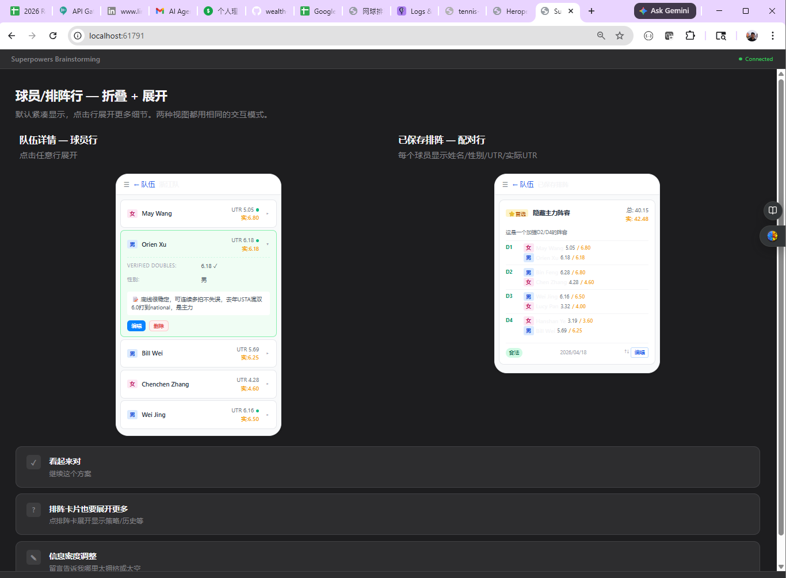

*This is a follow-up to [From Vibe Coding to Spec-Driven Development](/blog/2026/03/06/claude-code-spec-driven-development). That post documented introducing OpenSpec into an existing Finance project. This one covers a new project where I stacked OpenSpec with Superpowers from day one.*

After three months of running [OpenSpec](https://github.com/Fission-AI/OpenSpec) on my Finance project, I'd formed a clear picture of what it's good at and where it struggles. On a personal wiki project I'd also been using [Superpowers](https://github.com/obra/superpowers), and its `brainstorming`, TDD, and code-review skills were landing real hits.

So I started a new project — a UTR-based tennis team lineup app ([tennis-lineup](https://github.com/austinxyz/tennis-lineup)) — specifically to run both tools together and see how they compose. This post is the report.

<!--truncate-->

## Where OpenSpec Alone Fell Short

OpenSpec is excellent at **incremental change management**. The propose → apply → archive loop keeps a clean spec library, and the archive step preserves delta specs as an audit trail. For shipping features one at a time on an existing codebase, it's hard to beat.

But over three months on the Finance project, four gaps became obvious:

1. **Project bootstrap is weak.** OpenSpec drives *changes* well. On a brand-new project — where you need architecture, initial tech stack decisions, domain modeling — `opsx:propose` has nothing to anchor on.
2. **Specs capture intent, not interaction.** The spec tells AI *what* to build. UI details are often underspecified, and the first implementation rarely matches what I had in my head.
3. **Tasks list what, not how.** `tasks.md` is a checkbox list. There's no implementation plan per task, so AI fills gaps on its own — sometimes fine, sometimes off-track. Tasks get silently skipped.
4. **No test discipline.** I pushed "tests first" into `config.yaml`, but code quality was still inconsistent. Manual testing kept finding bugs a proper TDD cycle would have caught.

## Where Superpowers Fills the Gaps

Superpowers is a collection of Claude Code skills. The three that matter most for SDD work:

- `superpowers:brainstorming` — walks you through structured questions before writing any spec. Has a **Visual Companion** that generates HTML mockups you click through in the browser. Outputs a design spec at the end.
- `superpowers:writing-plans` + `executing-plans` — decomposes a spec into tasks, and each task into a red/green/refactor TDD sequence with exact file paths, commands, expected test output, and commit messages.
- `superpowers:requesting-code-review` — runs automatically after each task. Flags issues at CRITICAL / HIGH / MEDIUM / LOW levels with specific fixes.

OpenSpec covers change management and long-term spec accumulation. Superpowers covers upfront design, execution discipline, and review. They operate at different layers. They don't conflict — they stack.

## The Combined SDLC

Here's the workflow I settled on for tennis-lineup:

**Project init (once):**
1. `superpowers:brainstorming` to pin down requirements and architecture. Outputs a design doc I commit to `docs/`.
2. `openspec init`, then populate `config.yaml` — tech stack, conventions, test strategy (unit + integration + e2e) stated upfront.
3. Slice requirements by priority. Treat `docs/log/` as a living journal; require every session to append to it via `CLAUDE.md`.

**Per feature:**
1. If the feature is fuzzy, start with `superpowers:brainstorming` again. Use Visual Companion for anything UI-heavy. The output is a design spec.
2. Run `opsx:propose` with that design spec as input. Get `proposal.md`, `design.md`, and `tasks.md`.
3. Run Superpowers TDD against those tasks. It writes tests first, implements, runs the suite, and runs code review per batch.
4. Manual sanity check. Rework rate has been low.
5. `opsx:apply` to verify everything is ticked off — Superpowers usually already closed everything.
6. Deploy.
7. `opsx:archive` to merge the delta spec back into the main spec library.
8. Scan the day's log — lift any new gotchas into `CLAUDE.md` and `openspec/config.yaml`. Update the README.
9. Commit and push. Next feature.

The two tools hand off at clean boundaries: **Superpowers designs and builds; OpenSpec tracks and archives.**

## One Feature End-to-End: Mobile UI Optimization

To show how this plays out in practice, here's a real feature from 2026-04-19.

**The prompt:**

```
/superpowers:brainstorming I want to use the UI mock capability to optimize
the UI for mobile:
  - sidebar should be hideable
  - when the right side has two columns (e.g., team management), hide the
    team list once a team is selected
  - two-column card layouts (e.g., saved lineups) should collapse to a
    single column on mobile
```

**Step 1 — Brainstorming + Visual Companion.** Superpowers generated HTML mockups I clicked through in the browser, then wrote a [design spec](https://github.com/austinxyz/tennis-lineup/blob/main/docs/superpowers/specs/2026-04-19-mobile-ui-optimization-design.md).



**Step 2 — Propose.** `opsx:propose` took the design spec and produced an OpenSpec [proposal](https://github.com/austinxyz/tennis-lineup/blob/main/openspec/changes/archive/2026-04-19-mobile-ui-optimization/proposal.md) and [task list](https://github.com/austinxyz/tennis-lineup/blob/main/openspec/changes/archive/2026-04-19-mobile-ui-optimization/tasks.md) — 8 groups, 37 tasks.

**Step 3 — TDD execution in batches.** A representative batch result:

```
Batch 1 — Global shell (no backend changes)
Commit: 2e336bb

- New AppHeader.vue: hamburger menu + optional back button + title +
  actions slot; lg:hidden
- Refactored MainLayout.vue: provide('sidebarOpen', ref(false));
  Escape closes drawer
- Decision: SidebarDrawer.vue logic folded into MainLayout (no separate
  component needed)

Code review fixes:
  HIGH    inject fallback used a plain object (not a ref) — silently failed standalone
          → inject('sidebarOpen', ref(false))
  HIGH    hamburger aria-label was static "open nav" regardless of state
          → dynamic :aria-label + :aria-expanded
  HIGH    back button missing aria-label + type="button"
          → added, safe inside forms
  HIGH    removing pt-14 from MainLayout caused content to hide behind fixed header
          → restored pt-14 lg:pt-0
  MEDIUM  drawer had no Escape-to-close (WCAG 2.1.2)
          → global keydown listener in MainLayout
  LOW     missing overflow-x-hidden could flash horizontal scroll
          → added

Tests: 381 passing (16 new AppHeader tests)
```

This is the Superpowers loop working as designed: write test → implement → run → review → fix findings → commit. Every batch ended green.

**Step 4 — One honest mistake.** On the Opponent Analysis component, the UI mock only showed the mobile layout and I approved it without re-reading the existing spec. Superpowers implemented against the mock and silently dropped existing desktop functionality.

Fix:
1. Re-ran `superpowers:brainstorming` with the existing spec loaded, re-did the UI design.
2. Continued Superpowers TDD against the revised design.

Lesson went into `openspec/config.yaml` so the next change won't repeat it.

**Step 5 — Deploy, archive, update docs.** `opsx:archive` synced the delta spec back. `CLAUDE.md` got updates for E2E dual-render pitfalls, SOCKS5 proxy setup, and Windows localhost dual-stack. `config.yaml` got dual-render `data-testid`, backend restart rules, TOCTOU, deploy smoke tests, and "sync before archive."

Full detail in the [2026-04-19 log](https://github.com/austinxyz/tennis-lineup/blob/main/docs/log/2026-04-19.md).

**Result:**

<div style={{display: 'flex', gap: '1rem', justifyContent: 'center', flexWrap: 'wrap'}}>
  
  
</div>

## The Numbers

Window: `5c612fe` (design spec) to `ee4c3bd` (archive) — **3 hours 7 minutes**, including brainstorming, 6 implementation batches, one rollback + rework, E2E fixes, deploy, and archive.

**Code delta** (`git diff 3f75465..ee4c3bd`):

| Category | Files | +/− | Net |
|---|---|---|---|
| Vue source | 8 | +741 / −297 | +444 |
| Tests (unit + E2E) | 11 | +1094 / −16 | +1078 |
| Docs / specs / config | 22 | +2547 / −10 | +2537 |
| Brainstorming mockups | 19 | +4348 / −0 | +4348 |
| **Total** | **60** | **+8730 / −323** | **+8407** |

**Tests added:**
- Unit: +77 (365 → 442)
- E2E: +9 (44 → 53)
- **Total: +86 test cases**

**Timeline:**

| Time | Event |
|---|---|
| 09:00–09:23 | Brainstorming + design spec + implementation plan |
| 09:23–09:39 | Batch 1: AppHeader + MainLayout (+16 tests) |
| 09:39–09:54 | Batch 2: TeamManagerView + TeamDetail (+20 tests) |
| 09:54–10:00 | Batch 3: LineupCard (+12 tests) |
| 10:00–10:15 | Batch 4: LineupHistoryView (+9 tests) |
| 10:15–10:36 | Batch 5: LineupGenerator (+3 tests) |
| 10:36–10:49 | Batch 6: OpponentAnalysis rewrite (+46) — **rejected by user** |
| 10:49–10:50 | Revert + minimal mobile adaptation |
| 11:46 | Batch 13: OpponentAnalysis redesign TDD (+15 tests) + E2E fixes |
| 12:07 | Deploy to fly.io + archive |

**ROI observations:**
- 444 net source lines produced 86 test cases (test-to-code ratio ≈ 2.4:1 by line count).
- Biggest time sink was Batch 6 — the over-refactor and revert. Lesson cemented in `config.yaml`.
- 20 minutes of HTML mockups up front bought 2 hours of zero-rework implementation.

## `tasks.md` vs `plan.md`: What Each Is Good For

OpenSpec's `tasks.md` and Superpowers' `plan.md` are not the same artifact. They operate at different granularities and for different readers.

| Dimension | OpenSpec `tasks.md` | Superpowers `plan.md` |
|---|---|---|
| Length | ~60 lines | ~1300 lines |
| Granularity | 8 groups × 37 tasks, one sentence each | 11 Tasks × 4–9 Steps each (write test / run / implement / verify / commit) |
| Code blocks | ❌ | ✅ Full Vue templates, JS, test cases |
| File paths | Component names only | ✅ Exact paths (`frontend/src/components/AppHeader.vue`) |
| Commands | `mvn test` / `npm test` | ✅ Precise commands + expected output (`Expected: FAIL — ...`) |
| Testing | "add/update tests" | ✅ Runnable TDD red-green-refactor |
| Commits | One per group (~8 commits) | ✅ Exact commit message per Task (~11+ commits) |
| Self-check | Spec scenario → task mapping is implicit | ✅ Spec coverage checklist at the end |
| Risk notes | In `design.md` | ✅ Inline (e.g., "Task 8.7 depends on backend") |
| Reader assumption | Developer who knows the repo | Engineer with zero context can follow it cold |

**When each wins:**

`tasks.md` is good for:
- Fast scope review and checkbox tracking
- Confirming "is the feature done?" (`applyRequires` lives here)
- Cases where you or the AI already know the implementation details

`plan.md` is good for:
- Handing work to a fresh engineer or a subagent with no context
- Strict TDD — red / green / refactor made explicit at every step
- Small-granularity commits that are easy to `git bisect`
- Dispatching tasks to `superpowers:subagent-driven-development`

**How I actually use both:** `tasks.md` is the scope contract with OpenSpec. `plan.md` is the execution script for Superpowers. They share the same spec as source of truth — they just serve different phases.

## So Is OpenSpec Still Needed?

With Superpowers this capable, is there still a reason to run OpenSpec?

For me, yes — for three reasons.

1. **Small-step iteration discipline.** `propose → apply → archive` is a hard rhythm. It forces each change to have explicit scope, acceptance, and an archive step.
2. **Long-term spec library.** `opsx:archive` syncs delta specs into a growing `openspec/specs/` tree. Over months, this becomes the project's authoritative specification — similar to how I treat my LLM wiki as the core notebook. Superpowers' specs and plans live per-change; they don't accumulate a project-level view.
3. **Cross-check on completeness.** OpenSpec tasks and Superpowers plans can be diffed against each other. If the Superpowers run finished but an OpenSpec task is still open, something was missed.

Short version: **OpenSpec owns the spec lifecycle. Superpowers owns the design-and-execute loop inside a change.** The two together give me both long-term structure and per-change rigor.

## Token Cost

This change used ~180M tokens — driven by Opus 4.7 plus Visual Companion (which generates and iterates on HTML mockups). I'm on the Claude Code Max plan, so the actual out-of-pocket cost is fixed. For the delivered output — 444 source lines, 86 tests, design-to-archive in 3 hours with near-zero rework — it's acceptable.

## Key Takeaways

**1. Start every new project with brainstorming, not proposing.** OpenSpec can't bootstrap architecture from a one-liner. Superpowers' structured questioning can.

**2. Use Visual Companion for any UI change.** 20 minutes of clickable mockups prevents hours of mismatched implementation. This was the single highest-leverage tool in the workflow.

**3. Let Superpowers enforce TDD. Let OpenSpec enforce archival.** Don't expect either to do both well.

**4. Every mistake goes into `config.yaml`.** The Batch 6 over-refactor is now a prevention rule. This is the compounding advantage of SDD over Vibe Coding — mistakes turn into structure, not just git history.

**5. Keep a per-day log.** The `docs/log/YYYY-MM-DD.md` habit makes retrospectives cheap and fuels `CLAUDE.md` / `config.yaml` updates.

---

## References

**Project**
- [tennis-lineup on GitHub](https://github.com/austinxyz/tennis-lineup) — full source, including `CLAUDE.md`, OpenSpec config, and day logs
- [Mobile UI optimization change (archived)](https://github.com/austinxyz/tennis-lineup/tree/main/openspec/changes/archive/2026-04-19-mobile-ui-optimization)
- [2026-04-19 session log](https://github.com/austinxyz/tennis-lineup/blob/main/docs/log/2026-04-19.md)

**Tools**
- [OpenSpec](https://github.com/Fission-AI/OpenSpec) — lightweight SDD CLI
- [Superpowers](https://github.com/obra/superpowers) — Claude Code skills for brainstorming, TDD, and code review

**Related**
- [From Vibe Coding to Spec-Driven Development](/blog/2026/03/06/claude-code-spec-driven-development) — the prior SDD post this one builds on
