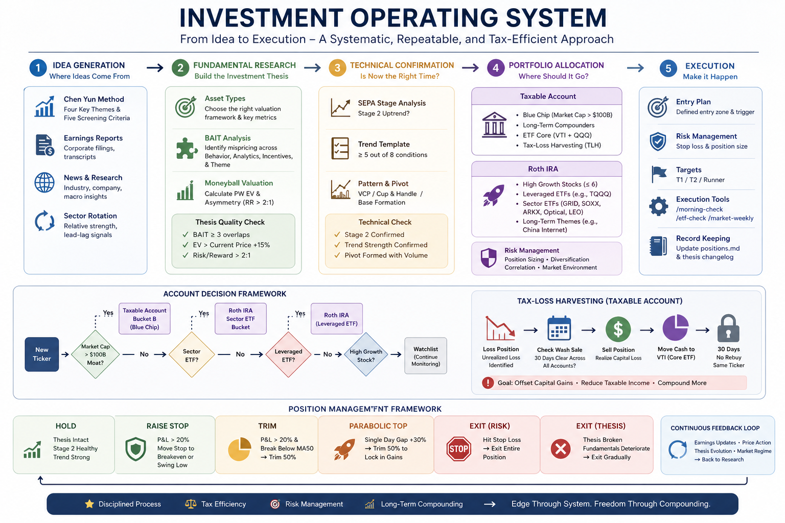

> This is part 3 of the AI Wealth Management series, exploring how to use Claude Code and LLM Wiki for personal investing.

Most investors I know operate in reaction mode. A friend texts about a hot stock. An earnings beat hits the news. A pundit on X says the sector is turning. Something triggers a buy or sell, and the decision feels analytical — but it's really just noise with a story attached.

What changed my investing wasn't reading more research or finding better sources. It was building a system. Specifically, it was treating my investment process the way a software engineer treats a production system: with defined inputs, explicit logic, observable state, and predictable outputs.

<!--truncate-->

I call this the Investment Operating System — IOS for short. It's a six-stage framework that runs on Claude Code and a private LLM Wiki.

---

## Knowledge Base and Analytical Tools

Before walking through the six stages, it's worth being clear about the underlying infrastructure — where the frameworks come from, which commands were built in-house, and how finance-skills relates to the framework logic. If you're curious about the implementation side — how the commands were built, the lessons from extending an open-source LLM wiki, and what it takes to graduate this to a production agent — that's covered in [Part 2](https://austinxyz.github.io/blogs/blog/2026/05/04/rwh-overlay-lessons). You don't need it to follow this post.

### Analytical Frameworks

Five frameworks, from two projects:

**Three frameworks from rwh upstream** (brought in with the upstream knowledge base):

| Framework | Core question | Used in |
|-----------|--------------|---------|
| **BAIT** | Why is the market mispricing this now? | Stage 2 (Fundamental Research) |
| **Moneyball PW EV** | How much does expected value exceed current price? | Stage 2 (Fundamental Research) |
| **Asset Types** | What metrics actually apply to this business model? | Stage 2 (Fundamental Research) |

**Two frameworks built in rwh-overlay** (maintained in the overlay's `frameworks/` directory):

| Framework | Core question | Used in |
|-----------|--------------|---------|
| **Chen Yun Method** | Is this stock part of a structural theme? | Stage 1 (Idea Generation) |
| **SEPA** | Is the timing technically right to buy? | Stage 3 (Technical Confirmation) |

### Command Inventory

rwh-overlay includes 14 custom commands (stored in the project's `.claude/commands/` directory):

| Command | Purpose |
|---------|---------|
| `/kb-sync` | Build and sync the combined knowledge base from upstream + overlay |
| `/stock-analyze <TICKER>` | Full research pipeline: 15-section thesis with BAIT, Moneyball PW EV, Asset Type |
| `/stock-refresh <TICKER>` | Thesis update after earnings or material news |
| `/stock-entry <TICKER>` | Granular entry and exit point analysis for a specific ticker |
| `/morning-check <TICKER>` | Open-time decision: thesis check, SEPA status, entry/stop/target |
| `/morning-check ALL` | Batch scan across all positions; surfaces anything requiring action |
| `/etf-analyze <TICKER>` | Deep ETF analysis: holdings review, expense ratio, liquidity, sector purity |
| `/etf-check` | Event-driven ETF sector DCA decision — checks trigger conditions |
| `/chen-integrate` | Parse Chen Yun observations and flag tickers for research |
| `/chen-validate <TICKER>` | Cross-validate a Chen-mentioned ticker against the investment frameworks |
| `/market-daily` | Daily market report and sector health summary |
| `/market-weekly` | Weekly taxable account action plan: TLH opportunities, blue chip candidates, DCA execution |
| `/market-monthly` | Monthly portfolio and thesis review |
| `/market-quarterly` | Quarterly portfolio and strategy review |

### How finance-skills Plugs In

[finance-skills](https://github.com/himself65/finance-skills) is installed in plugin mode and provides data retrieval and technical analysis. Each command calls the relevant skills as needed when executing framework logic:

| finance-skills tool | Supports which framework/command | What it does |
|---------------------|----------------------------------|--------------|
| `finance-market-analysis:sepa-strategy` | SEPA → `/morning-check` | Stage classification, Trend Template 8-criteria check, VCP/cup-handle pattern recognition, breakout volume validation |
| `finance-earnings:calendar` | Moneyball PW EV → `/stock-analyze` | Latest EPS data, beat/miss vs. estimate, guidance changes — inputs for three-scenario modeling |
| `finance-market:options-flow` | BAIT (Technical layer) → `/stock-analyze` | Institutional options activity, signals for technical selling pressure or short-squeeze setup |

These tools appear across all six stages. The custom commands are the orchestration layer that wires framework logic and finance-skills data retrieval together.

---

## The Six Stages at a Glance



The IOS runs linearly from idea to position, but it's not a waterfall. Ideas can enter at Stage 1 and die at Stage 2. A position that clears Stage 5 gets monitored continuously through Stage 6, and thesis changes can send it back for re-evaluation. Here's the quick map:

1. **Idea Generation** — where candidates come from, and what screening criteria they must pass before moving forward
2. **Fundamental Research** — three parallel frameworks that determine whether the market is mispricing the stock, and by how much
3. **Technical Confirmation** — trend and pattern analysis to confirm the timing is right, not just the thesis
4. **Portfolio Allocation** — deciding which account type gets the position, driven by tax and risk logic
5. **Execution** — entry price, stop-loss, price targets, and a go/no-go market environment check
6. **Position Management** — explicit rules for every signal that can occur after entry

---

## Stage 1: Idea Generation

Every position starts as an idea. The question is whether the idea came from signal or noise.

I track four sources:

**Chen Yun method.** Chen Yun is an independent analyst whose sector calls I cross-reference for thematic direction. I don't follow his stock picks directly — I use them as a temperature check on which sectors are getting institutional attention. When his thesis aligns with something I'm already seeing in fundamentals, that's a signal worth pursuing.

**Earnings reports.** Beats and misses move stocks, but what I care about is what management says about the next two to four quarters. Guidance changes — especially when a company raises full-year guidance despite beating — often reveal durable inflection points that take months for the market to fully price in.

**News and structural trends.** Right now I'm watching power grid infrastructure, utility-scale battery storage, optical interconnects (driven by hyperscaler AI buildout), and LEO satellite broadband. These are multi-year capital deployment stories. When a specific company within one of these themes starts showing up in multiple sources — an earnings call transcript, a supply chain analysis, a regulatory filing — it crosses my radar.

**Sector rotation signals.** Relative strength shifts between sectors can precede individual stock moves by weeks. When money rotates into industrials after a long period of tech dominance, I start looking for specific industrials plays rather than chasing the sector ETF.

Once an idea surfaces from any of these sources, I run a quick five-criterion screen before committing research time: sector tailwind present, revenue growth >15% YoY, management credibility, identifiable catalyst within 90 days, and no obvious red flags (accounting concerns, excessive dilution, litigation overhang). If a stock meets three or more, I run `/stock-analyze <TICKER>`.

**What `/stock-analyze` does**

This command is the entry point for the full research pipeline. It produces a 15-section thesis document by reading three layers of information in parallel:

1. **rwh wiki** (blue chips) or **overlay sector analysis** (thematic positions) — distilled fundamental context
2. **finance-skills `finance-earnings:calendar`** — latest earnings data, EPS vs. estimate, guidance changes
3. **overlay sector synthesis** — connecting company-level events to the multi-year capital deployment story

With that data in hand, the command applies three frameworks in sequence: Asset Type determines the right valuation lens → BAIT identifies the mispricing source → Moneyball PW EV quantifies the opportunity. The output writes to `wiki/tickers/<TICKER>/thesis.md`.

---

## Stage 2: Fundamental Research

This is where most of the intellectual work happens. I run three frameworks in parallel — not sequentially — and require convergence before moving forward.

### BAIT: Why Is the Market Wrong?

BAIT stands for Behavioral, Analytical, Informational, and Technical mispricing. The premise is simple: if the market is efficiently pricing everything, there's no edge. So I ask: in which of these four categories is the market making an error on this stock?

- **Behavioral**: Is the market overreacting to short-term bad news on a structurally sound business? Is fear or recency bias driving the price?
- **Analytical**: Are consensus models using the wrong assumptions — wrong revenue mix, wrong margin trajectory, wrong addressable market?
- **Informational**: Do I have access to data or context that institutional analysts aren't weighting correctly? (Supply chain checks, channel inventory data, regulatory filings that haven't been widely parsed)
- **Technical**: Is the stock in a mechanically forced position — index rebalancing, short squeeze setup, options expiration pressure?

I require overlap in at least three of the four categories for a high-conviction position. A stock where I can only articulate one reason the market is wrong is a low-conviction bet, and I treat position sizing accordingly.

### Moneyball PW EV: Does the Math Work?

The second framework is probability-weighted expected value. I model three scenarios — Bull, Base, Bear — with price targets and probability weights for each. The weighted average gives me a PW EV.

My entry criteria: PW EV must exceed the current price by at least 15%, and the upside-to-downside ratio must be greater than 2:1. This filters out "probably fine" ideas from genuinely asymmetric opportunities.

For example: if a stock trades at $50, my Bull case is $95 (30% probability), Base is $68 (50% probability), and Bear is $35 (20% probability):

PW EV = (95 × 0.30) + (68 × 0.50) + (35 × 0.20) = 28.5 + 34 + 7 = $69.50

That's 39% above current price, with an upside-to-downside ratio of roughly 3.2:1. That clears both thresholds.

### Asset Type: Which Valuation Metrics Actually Matter?

Not every business should be valued the same way. A SaaS company at 40x revenue is a different analytical problem than an industrials compounder at 18x earnings. This framework forces me to explicitly categorize the business model — recurring revenue software, capital-light marketplace, asset-heavy infrastructure, commodity-exposed manufacturer — before applying any valuation lens. Getting this wrong leads to comparing apples to bulldozers.

### The thesis.md Structure

All three frameworks' outputs get written to `wiki/tickers/<TICKER>/thesis.md`. The file follows a fixed 15-section structure:

| Section | Content |
|---------|---------|
| Executive Summary | One paragraph: why this stock, why now |
| Company Overview | Core business, revenue structure, key customers |
| Asset Type Classification | Growth / Platform / Cyclical / Defensive — determines valuation method |
| Competitive Moat | Moat sources: technology, scale, network effects, regulatory barriers |
| Sector Context | Structural drivers and key risks for the theme |
| BAIT Analysis | Score across four dimensions, note overlap sources |
| Moneyball Calculation | Three scenarios, probability weights, PW EV conclusion |
| Bull Case | Trigger conditions + 12–18 month price target |
| Base Case | Expected path under neutral assumptions |
| Bear Case | Valuation floor if key risks materialize |
| Key Catalysts | Specific events in the next 90 days that could shift market judgment |
| Key Risks | Factors that would invalidate the thesis |
| SEPA Technical Status | Stage classification / Trend Template / current pattern |
| Synthesis | Whether to advance to the next stage, and why |
| Changelog | Timestamped record of what changed and when |

The LLM Wiki tracks how theses evolve over time through that changelog — so I can see when original assumptions are being confirmed versus quietly invalidated.

---

## Stage 3: Technical Confirmation

A great fundamental thesis at the wrong time is just a slow loss. Technical analysis in the IOS isn't about chart patterns for their own sake — it's about confirming that the price action is consistent with the thesis, and that the stock is in a phase where institutional buying is likely to drive the move I'm expecting.

I use SEPA — an approach combining Stage Analysis with a Trend Template:

**Stage 2 confirmation.** The stock must be in a Stage 2 uptrend (defined by price above a rising 200-day MA, with shorter MAs in proper sequence). A stock in Stage 3 (topping) or Stage 4 (decline) is not eligible regardless of fundamentals.

**Trend Template.** Eight criteria, including: price above 200-day MA, 200-day MA trending up for at least 4 weeks, price above 50-day MA, 50-day MA above 200-day MA, RS line at or near 52-week highs. I require at least five of eight to pass.

**Pattern recognition.** I'm looking for constructive base patterns: Volatility Contraction Pattern (VCP), cup-and-handle, or flat base. These patterns indicate institutional accumulation — quiet buying that compresses volatility before a breakout. A clear pivot point must be identifiable.

**Volume confirmation.** On the breakout day, volume must exceed 150% of the 50-day average volume. Low-volume breakouts fail significantly more often.

Running `/morning-check <TICKER>` against these criteria outputs one of four verdicts: **Execute** (all criteria met, enter at pivot), **Chase 50%** (stock broke out already but within 5% of pivot, take half position), **Wait** (good setup but not triggered yet), or **Skip** (criteria not met, move on).

**Where SEPA comes from, and what `/morning-check` integrates**

The SEPA analysis is provided by finance-skills' `finance-market-analysis:sepa-strategy`. That skill automatically handles: 200-day MA slope assessment (Stage 2 classification), all eight Trend Template criteria, VCP contraction count and depth, and breakout volume vs. 50-day average.

`/morning-check` builds on top of that with additional layers:

- **rwh wiki + thesis.md**: current thesis status (is the thesis still intact?)
- **finance-earnings:calendar**: earnings this week, whether in quiet period
- **data/positions.md**: cost basis, current P&L, the stop-loss level already set
- **overlay sector analysis**: whether recent sector news affects the individual thesis

The final output is an actionable recommendation, not a data dump.

---

## Stage 4: Portfolio Allocation

Every position that clears Stages 2 and 3 gets assigned to an account. This isn't arbitrary — it's driven by tax and risk logic.

| Asset type | Account |
|---|---|
| Leveraged ETFs (TQQQ, TSLL) | Roth IRA only |
| High-growth individual stocks (market cap < $100B) | Roth IRA |
| Sector theme ETFs | Roth IRA |
| Blue-chip stocks (market cap > $100B, durable moat, hold ≥ 1 year) | Taxable |
| Broad index ETFs (VTI, QQQ) | Taxable (DCA) |

The Roth IRA is the high-octane account. Tax-free compounding means I want the highest-expected-return, highest-volatility positions there — the ones that might double, but also might get cut at a 7% stop-loss. All that churn happens with zero tax drag.

The taxable account is the quality-compound account. Blue chips held longer than a year qualify for long-term capital gains rates. More importantly, the taxable account enables Tax Loss Harvesting — when a position dips, I can sell it to realize a loss that offsets gains elsewhere, then buy a correlated (but not substantially identical) position to maintain market exposure.

The account assignment rules live permanently in `data/profile.md`. Every time a trade executes, `data/positions.md` gets updated to record which account holds the position, along with the tax lot details.

---

## Stage 5: Execution

A stock can pass every prior stage and still be entered at the wrong price. Stage 5 is where I define the exact execution parameters before placing any order.

The `/morning-check` command outputs:

- **Entry price range**: pivot point ± 5% (no chasing more than 5% past the breakout level)
- **Stop-loss level**: the lower of the Moneyball Bear Case price and the MA50 at the time of entry
- **T1 and T2 price targets**: derived from the Bull and Base scenario price targets
- **Risk/reward ratio**: position is only entered if R/R ≥ 2:1 based on stop-loss distance and T1 target
- **Market environment check**: SPY and QQQ must both be above their 200-day MA for full-size entry; if below, position size is cut by half

That last point matters more than people think. Even great individual setups fail at higher rates when the broad market is in a downtrend. The market environment check isn't a filter I override for "exceptional" ideas — it's a hard constraint.

When I need more granular entry and exit point analysis — for instance, when a stock is near its pivot but I want to evaluate multiple entry scenarios — I run `/stock-entry <TICKER>`. After entry executes, I manually update `data/positions.md` with the actual entry price, share count, and stop level.

---

## Stage 6: Position Management

This is where most retail investors break down. Entry is relatively easy to systematize. Management — knowing when to hold, trim, or exit — is where emotion creeps in and rules get bent.

The IOS makes these decisions explicit before they need to be made.

**Roth IRA positions:**

| Signal | Action |
|---|---|
| Hits stop-loss | Exit 100% — no exceptions |
| P&L > +20%, Stage 2 healthy | Hold, raise stop to breakeven |
| P&L > +20%, breaks MA50 | Trim 50%, trail stop on remainder |
| Single-day gap up +30% | Trim 50% to lock gains |
| Thesis broken (guidance cut, key executive departure, competitive disruption) | Lower trim threshold, evaluate full exit |

The stop-loss rule has exactly zero exceptions. The purpose of a stop-loss is to make the decision before you're emotional about it. Once a position is down 7-8% from entry and hits the stop, you exit. The thesis might still be intact. The chart might look like a temporary dip. Exit anyway. This rule has protected more capital for me than any individual stock pick.

**Taxable positions:**

Tax is a first-class variable in the taxable account, not an afterthought. A blue chip in drawdown held for less than one year gets a tax calculation before any sell decision — because selling at a short-term rate and then watching the stock recover is a double loss. The `/market-weekly` command generates a weekly action plan for the taxable account, including current TLH opportunities, candidates for new blue-chip adds, and DCA execution schedules for index positions.

---

## The Private Data Layer

Here's the part that makes the IOS actually useful rather than theoretically sound: Claude has access to data that's specific to my situation.

The private layer lives in `data/`, which is git-ignored entirely. Three files that never leave my machine:

- `data/positions.md` — current holdings in each account, with cost basis, entry date, and current P&L
- `data/profile.md` — risk tolerance, time horizon, tax bracket, liquidity constraints
- `data/strategy/` — annual strategy documents covering macro thesis, sector weightings, and target portfolio composition

When I run `/stock-analyze NVDA`, Claude isn't generating generic research. It's reading my current Roth IRA positions and telling me: "You're already at six individual stock positions in Roth, which is your stated maximum. To add NVDA you'd need to exit one existing position. Based on thesis strength ranking, SMCI is the weakest — here's why."

Without this layer, AI gives you a framework. With it, AI gives you advice for your specific situation. That's the difference between a textbook and a financial advisor who actually knows your portfolio.

**What `positions.md` looks like**

Here's the template structure (all figures below are illustrative — no real positions):

```markdown
# Positions

## Roth IRA

### XXXX (entered: 2025-01)
- Entry: $XX.XX | Shares: XXX | Cost basis: $X,XXX
- Stop: $XX.XX | T1: $XX.XX | T2: $XX.XX
- Current status: Stage 2 ✅ | P&L: +XX%
- Thesis status: Active
- Next attention trigger: XXXX earnings (Q1 2025)

## Taxable

### XXXX (entered: 2024-06)
- Entry: $XX.XX | Shares: XXX | Cost basis: $XX,XXX
- Hold plan: Long-term (>1 year, LTCG rate)
- Thesis status: Active
- TLH status: Last same-ticker purchase >30 days ago, wash sale window open
```

Claude Code reads this file alongside each ticker's wiki thesis and live market data to generate recommendations specific to your actual positions — not a generic analysis.

---

## A Week in the Life

The IOS sounds elaborate on paper. In practice, it runs on about two to three focused hours per week across a regular cadence.

**Monday morning.** `/morning-check ALL` before the market opens — about fifteen minutes. It surfaces stops to watch, thesis changes, and anything needing pre-market action. If a new entry is confirmed, `/stock-entry <TICKER>` follows. At close, `/market-daily` for a sector health snapshot.

**Weekdays.** New ideas arrive asynchronously. If one passes the five-criterion screen mentally, I queue `/stock-analyze <TICKER>` and review the output when I have time. For existing positions, breaking news — a guidance revision, a key analyst call — triggers `/stock-refresh <TICKER>` on the spot rather than waiting for the monthly cycle. ETF opportunities follow a separate trigger-based track.

**Sunday.** `/market-weekly` for the taxable account: TLH opportunities, blue chip candidates, DCA execution for VTI/QQQ.

**Monthly.** `/stock-refresh` on the five to eight core holdings, plus `/market-monthly` for a broader portfolio and strategy review.

The decision logic behind each of these is in the workflow diagrams below. The system doesn't eliminate judgment — I still make the final calls — but the judgment is grounded in a consistent framework rather than whatever mood I'm in on a Tuesday morning.

---

## Four Core Workflows

The system runs on four workflows. Each has explicit inputs, outputs, and commands.

### 1. Individual Stock Research → Entry

```
[New idea]
    │
    ├─ Chen Yun signal / sector scan / earnings surprise / news
    │
    ▼ Five-criterion screen: ≥3 pass
[/stock-analyze <TICKER>]
    │
    ├─ BAIT ≥3 overlap? → No: Watch list
    ├─ PW EV > current price +15%, up/down >2:1? → No: Wait
    └─ Yes ↓
[/morning-check <TICKER>]
    │
    ├─ SEPA Stage 2 + Trend Template ≥5/8
    └─ Output: Execute / Chase 50% / Wait / Skip
    ↓ Execute
[/stock-entry <TICKER>]   ← precise entry range, stop, T1/T2 targets
    ↓
    Update data/positions.md
```

### 2. Daily Position Monitoring

```
[Every morning before open]
    ↓
[/morning-check ALL]
    │
    ├─ Scan all positions: stop status / technical structure / thesis changes
    ├─ Flag positions with earnings this week
    └─ Output priority list: act now / watch / no action needed

[At market close]
    ↓
[/market-daily]   ← sector health summary, notable signal changes

[Breaking news on existing position mid-week]
    ↓
[/stock-refresh <TICKER>]   ← thesis update without waiting for monthly cycle
```

### 3. Sector ETF DCA

```
[Trigger (any one of)]
    ① Chen Yun ≥3 mentions of this sector in the past 7 days
    ② ETF price ≤ MA50 −5%
    ③ Fear & Greed < 30
    ↓
[/etf-check --sector <sector-name>]
    │
    ├─ Compare ETFs in sector (expense ratio / liquidity / holdings purity)
    └─ Output: recommended ETF + suggested buy amount (based on target allocation gap)

[New sector or deeper evaluation needed]
    ↓
[/etf-analyze <TICKER>]   ← full ETF deep-dive before committing
    ↓ Confirm
    Update data/positions.md
```

### 4. Periodic Portfolio Review

```
[Every Sunday]
    ↓
[/market-weekly]
    │
    ├─ TLH scan: underwater positions + wash sale compliance check
    ├─ Blue chip candidates: rwh latest Initiate/Add + current price assessment
    └─ DCA execution: VTI/QQQ buy amount for the week
    ↓
    Writes to data/morning-checks/taxable-action-YYYY-WXX.md (private)

[Monthly]
    ↓
[/stock-refresh <TICKER>] on 5–8 core holdings   ← full re-evaluation with latest earnings
[/market-monthly]   ← broader portfolio and strategy review
```

**System output files**

| File | Updated when | Private? |
|------|-------------|---------|
| `wiki/tickers/<TICKER>/thesis.md` | After `/stock-analyze` or `/stock-refresh` | Public |
| `output/market/YYYY-MM-DD.md` | After `/market-daily` | Public |
| `data/positions.md` | After each trade | Private |
| `data/profile.md` | When risk tolerance or tax situation changes | Private |
| `data/strategy/roth-2026.md` | Annual strategy updates | Private |
| `data/strategy/taxable-2026.md` | Annual strategy updates | Private |
| `data/morning-checks/taxable-action-YYYY-WXX.md` | After each `/market-weekly` | Private |

---

## Why "Operating System" Is the Right Metaphor

An operating system doesn't make decisions. It provides the environment in which decisions happen reliably. It manages resources, handles interrupts, enforces rules, and keeps processes from interfering with each other.

That's exactly what the IOS does for investing. It doesn't tell me which stocks will go up. It ensures that every decision I make — buy, hold, trim, exit — is grounded in consistent logic rather than reactive emotion. When a position hits a stop-loss, the OS says exit. When a thesis breaks, the OS says reassess. When a stock has a great fundamental setup but terrible technicals, the OS says wait.

The AI layer makes this practical at individual investor scale. I don't have a research team. I can't monitor six markets simultaneously or model three scenario trees before every trade. Claude does the analytical heavy lifting; I provide the judgment layer and the private data that makes the output relevant to my actual portfolio.

The result isn't perfection. Some positions hit stop-losses. Some theses break. But the error rate is lower, the position sizing is more rational, and most importantly — I know why I'm in every position I hold, and I know exactly what would change my mind.

That's what systematic investing looks like in practice.

---

## Further Reading

- [Part 1: Building Your Personal Finance Knowledge Base with Claude Code](https://austinxyz.github.io/blogs/blog/2026/05/04/wealth-llm-wiki)
- [Part 2: From LLM Wiki to Investment Agent — Lessons from Building rwh-overlay](https://austinxyz.github.io/blogs/blog/2026/05/04/rwh-overlay-lessons)
