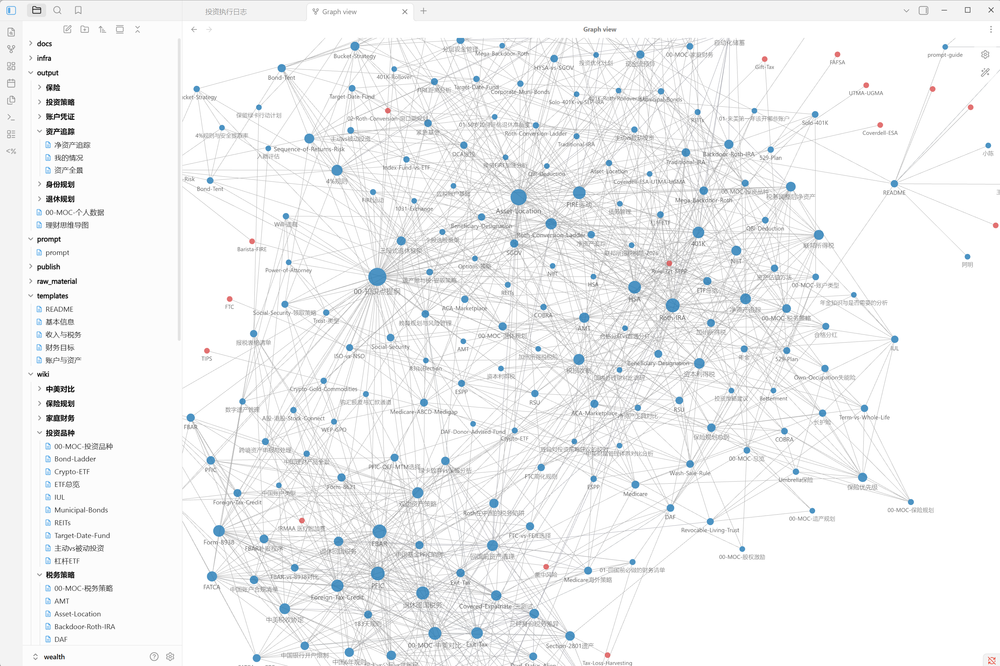

> This is part 1 of the AI Wealth Management series, exploring how to use Claude Code and LLM Wiki for personal investing.

Most people with real expertise — in finance, law, immigration, or anything else — carry it around in their heads, where it helps no one and can't compound. This post is about changing that: building a structured knowledge base that AI can reason over directly, and that can eventually serve others or generate income.

I'll use personal finance as the example domain. North American finance is genuinely complex — 401K, Roth IRA, HSA, Wash Sale Rule, FBAR, cross-border compliance — and worth systematizing. But the method here is domain-agnostic. Same approach works for any field where you have accumulated expertise.

<!--truncate-->

---

## The Two Tools: Claude Code and LLM Wiki

### Claude Code

[Claude Code](https://claude.ai/code) is Anthropic's CLI-based AI assistant. The key difference from browser-based AI: it runs in your terminal and can read and write files on your computer directly.

This matters because it changes what "personalized advice" means. A chat-based AI doesn't know your situation — it gives generic answers. Claude Code can read a file describing your actual 401K balance, tax bracket, and current holdings, and give you advice grounded in your specific circumstances.

You don't need to write code to use it. You give it instructions in plain English.

### The LLM Wiki Method

[Karpathy's LLM Wiki concept](https://gist.github.com/karpathy/442a6bf555914893e9891c11519de94f) proposes a three-layer knowledge structure:

```
raw_material/    ← source material: articles, notes, links you collect
wiki/            ← distilled knowledge: structured, evergreen reference entries
output/          ← synthesis: analysis based on your personal situation
```

The flow: you feed raw material to the AI, it distills it into wiki entries. When you have a decision to make, the AI reads the wiki plus your personal context (in `output/`) and gives you specific, grounded advice.

### Why Combine Them

Claude Code without a structured knowledge base gives you generic answers — the AI doesn't know what you know. LLM Wiki without Claude Code means manually managing everything yourself. Together: Claude Code becomes the operating system for your knowledge, and the knowledge base makes every answer relevant to your actual situation.

---

## Setting Up the Project

### Install the Tools

You need three things:

**VS Code** — for viewing and editing Markdown files. Download at [code.visualstudio.com](https://code.visualstudio.com).

**Claude Code** — install via npm:
```bash
npm install -g @anthropic-ai/claude-code
```
Requires Node.js ([nodejs.org](https://nodejs.org)) and a Claude Pro subscription (~$20/month). If you prefer not to use the CLI, Claude.ai's Projects feature can do similar work — but Claude Code is more capable for file operations and skill automation.

**Git + GitHub** — version control for your knowledge base. Install Git at [git-scm.com](https://git-scm.com), then create a free account at [github.com](https://github.com). New to Git? [GitHub's setup guide](https://docs.github.com/en/get-started/getting-started-with-git/set-up-git) is the right starting point.

### Initialize with a Prompt

Create a folder called `wealth-llm-wiki` and open Claude Code inside it:

```bash
cd ~/Documents/wealth-llm-wiki
claude
```

Then paste this initialization prompt:

```
Initialize a personal finance knowledge base using the LLM Wiki three-layer structure.
Reference Karpathy's LLM Wiki methodology: https://gist.github.com/karpathy/442a6bf555914893e9891c11519de94f

Create:
1. Directory structure:
   - raw_material/ (source articles, notes, links)
   - wiki/ (distilled knowledge entries, organized by topic)
   - output/ (personal data and analysis — never committed to Git)

2. README.md in each directory explaining its purpose and conventions

3. CLAUDE.md (instructions for Claude Code itself) including:
   - Project overview: personal finance knowledge base
   - Directory structure
   - Writing conventions: technical terms in English, explanations in plain language
   - Privacy rules:
     * Never put personal account balances, specific holdings, or dollar amounts in raw_material/ or wiki/
     * All personal data goes in output/ (git-ignored)
     * Wiki entries use general examples, not personal data

4. .gitignore that excludes output/ and *.private files

5. git init

Confirm the directory structure and that CLAUDE.md includes the full privacy rules.
```

After Claude Code runs, your project looks like this:

```
wealth-llm-wiki/
├── CLAUDE.md
├── .gitignore
├── raw_material/
│   └── README.md
├── wiki/
│   └── README.md
└── output/
    └── README.md
```

**CLAUDE.md is the key**: every time you open Claude Code in this project, it reads that file automatically. You never have to re-explain the project context.

---

## Building the Knowledge Base

### Step 1: Create the Knowledge Skeleton

Scaffold your wiki structure first — categories and entry lists before content:

```
Create the directory structure and outline for a North American personal finance
knowledge base under wiki/.

Categories:
1. financial-basics/ — account types, credit system, net worth calculation
2. investing/ — ETF vs active funds, US stocks, asset allocation, brokerage accounts
3. tax/ — federal tax brackets, capital gains, Wash Sale Rule, FBAR/FATCA
4. retirement/ — 401K, Roth IRA vs Traditional IRA, Mega Backdoor Roth, 401K Rollover
5. cross-border/ — US-China wire transfers, foreign account reporting, FX risk
6. education/ — 529 Plan basics, 529 vs Roth IRA for education

For each category: create the folder and an index.md listing the entries to build.
```

### Step 2: Fill Entries On Demand

You don't need to fill everything at once. Build entries when you need them. Here's the full pattern for a 401K Rollover entry:

**First**, collect raw material: go to IRS.gov, Investopedia, or wherever you trust, and paste the relevant content into `raw_material/retirement/401k-rollover-sources.md` with source links.

**Then**, ask Claude Code to distill it:

```
Read raw_material/retirement/401k-rollover-sources.md and distill it into a
wiki entry at wiki/retirement/401k-rollover.md.

Requirements:
- Structure: Overview → Options → Comparison → Key rules → Common mistakes
- Use general examples, no personal dollar amounts
- Link related concepts with [[Wiki Links]] (e.g., [[Traditional IRA]], [[Roth IRA]])
- Add YAML frontmatter: tags: [retirement, 401k, rollover]
```

The output will be a structured entry covering the four rollover options (stay in old plan / roll to new 401K / roll to IRA / cash out), the 60-day rule, Direct vs Indirect rollover mechanics, and the most common mistakes.

---

## Browsing with Obsidian

[Obsidian](https://obsidian.md) is a Markdown-native knowledge tool that makes navigating the wiki much better than a plain file browser.

Open your entire `wealth-llm-wiki` folder as an Obsidian vault (the root directory, not just `wiki/`) — so you can see `raw_material/`, `wiki/`, and `output/` together.

Install two community plugins:
- **Dataview** — query your wiki like a database ("list all entries tagged `retirement`")
- **Templater** — create templates for personal situation files in `output/`, so your records stay consistently structured

The Graph View shows knowledge connections visually as your wiki grows:



---

## Skills for Automation

A [Claude Code Skill](https://docs.anthropic.com/en/docs/claude-code/slash-commands) is a structured prompt stored as a file and invoked with a slash command. Once you've created a skill, you call it instead of writing the prompt from scratch. Claude Code can generate skills for you.

Two useful ones for this knowledge base:

**`/wealth-extract`** — distill a new source file into a wiki entry:

```
Create a skill named wealth-extract.

Function:
- Accept a file path in raw_material/ as an argument
- Identify the relevant finance topic
- Distill into a standard wiki entry (structured, [[wiki links]], YAML frontmatter)
- Save to the appropriate wiki/ subdirectory
```

Usage: `/wealth-extract raw_material/tax/roth-conversion-article.md`

**`/wealth-sync`** — audit what hasn't been processed yet:

```
Create a skill named wealth-sync.

Function:
- Scan all files in raw_material/
- Compare against wiki/ to find unprocessed source material
- Output a Markdown table: file name, inferred topic, suggested wiki destination
```

Run `/wealth-sync` weekly to see what's in your raw pile waiting for distillation.

---

## The Private Data Layer

The `output/` directory is where generic knowledge becomes personal advice.

Create `output/my-situation.md` with your actual details:

```markdown
# Personal Financial Situation

## Employment
- Software engineer at a tech company, changed jobs this year
- 401K: employer matches 50% up to 6%
- Tax filing: MFJ, 22% federal bracket, ~$X AGI

## Accounts
- Roth IRA at Fidelity: $X balance
- Previous employer 401K to roll over: $X
- Taxable brokerage: mostly index funds

## China assets
- Bank deposits over $10,000 — annual FBAR filing required
- Annual transfers within $10K limit

## Family
- Married, one child, planning 529 contributions
```

This file is `.gitignore`'d — it never leaves your computer. But with it in scope, when you ask "should I do a Roth conversion this year?", Claude Code reads your actual tax bracket and account sizes, not a generic example.

The more specific the file, the more useful the advice.

---

## Publishing with Quartz

If your wiki content is solid and you want to share it, [Quartz](https://quartz.jzhao.xyz) converts Obsidian-format Markdown to a static website with working wiki links and search. Deploy to GitHub Pages or a cloud platform (Vercel, Cloudflare Pages).

You control what you publish: `wiki/` only, or `raw_material/` and `wiki/` together if you want to show your research process. `output/` stays private regardless — the `.gitignore` enforces this at the repo level.

---

## What This Can Become

The framework is designed to grow. Depending on your goals:

**Self-use** — better decisions, faster research, clearer questions when you do talk to a CPA or advisor.

**Share raw + wiki** — your knowledge work becomes a public resource. Builds reputation in your domain.

**Partial sharing** — publish the wiki, keep the deep-dive analysis private. The public content demonstrates your expertise; people who want personalized analysis find you.

**Client directory** — set up an `output/clients/` structure. Use your knowledge base to serve multiple people, with each client's data isolated in their own folder. Output stays private; the wiki is your shared foundation.

**Specialist agent** — once you've served enough clients, the patterns repeat. Build a Claude Code skill that captures your analysis framework, and let it handle the initial pass. You review and finalize.

---

## Further Reading

- [Part 2: From LLM Wiki to Investment Agent — Lessons from Building rwh-overlay](https://austinxyz.github.io/blogs/blog/2026/05/04/rwh-overlay-lessons)
- [Part 3: The Investment Operating System — Full Workflow Walkthrough](https://austinxyz.github.io/blogs/blog/2026/05/04/investment-os)
- [Karpathy's LLM Wiki Gist](https://gist.github.com/karpathy/442a6bf555914893e9891c11519de94f)
- [wealth-llm-wiki on GitHub](https://github.com/austinxyz/wealth-llm-wiki)
