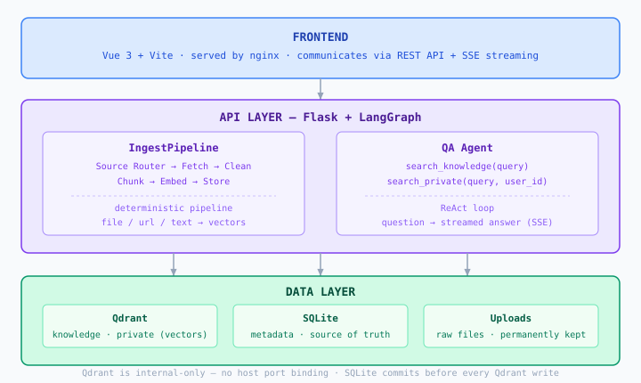
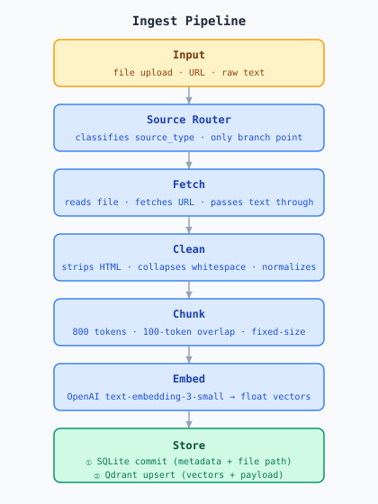
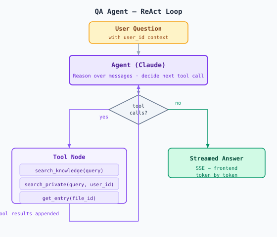
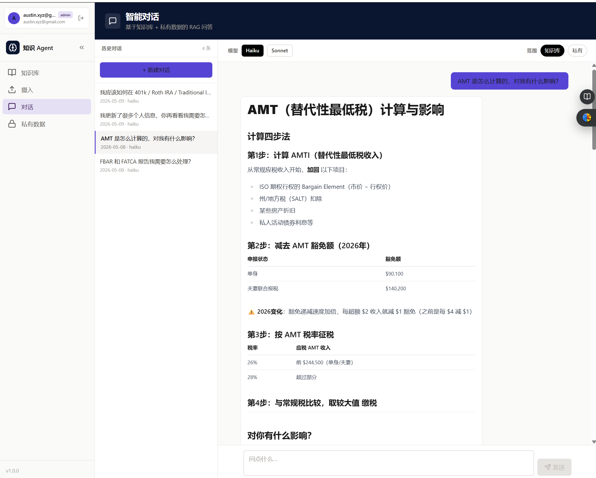

> This is part of the Agent Engineering track. [Building a Personal Finance Knowledge Base with LLM Wiki](/blog/2026/05/04/wealth-llm-wiki) built the knowledge base. [Building an AI Agent: From Claude Skills to Production](/blog/2026/05/04/rwh-overlay-lessons) extended it into a production personal tool. This post is the next step: building an actual agent application — one that runs independently, serves multiple users, and doesn't require you to be sitting at a terminal.

I already had a working LLM Wiki setup. Structured Markdown files, Claude Code reading them at query time, a set of slash commands that composed into useful workflows. It worked well — for me, running it myself, from my own machine.

Three things eventually broke that model. First, I wanted my wife to be able to use it without opening a terminal. Second, the knowledge base grew past what fit cleanly in a context window. Third, I wanted a morning scan to run on a schedule rather than requiring me to trigger it manually.

None of those problems is hard to state. Each one requires a fundamentally different architecture to solve.

This post is the engineering record of what I built: [python-agent](https://github.com/austinxyz/python-agent), a multi-user knowledge base agent running as a self-hosted Docker application. LangGraph for orchestration, Qdrant for vector storage, Flask + Vue for the web layer. The domain is personal finance, but nothing about the architecture is finance-specific.

This is not a feel-good tutorial. The implementation decisions were right more often than wrong, but the failure modes were real — I'll describe four of them in detail. The point is not to discourage you from building agents; it's to give you a more accurate map of the terrain than the docs provide.

<!--truncate-->

---

## 1. The Architecture Decision

Before writing any code, I had to decide what I was actually building. The LLM Wiki approach I'd used before has a clean mental model: knowledge lives in files, Claude reads the files, Claude answers questions. The agent loop is Claude Code itself — you don't build one, you use one.

When you need a multi-user web application, that model collapses. Claude Code is an interactive CLI session. There's no user isolation, no persistent service, no HTTP layer. You have to build the agent loop yourself.

That means choosing four things: an orchestration framework, a vector database, a backend framework, and a data isolation strategy. Here's what I chose and why.

**LangGraph, not a hand-rolled loop.**
The simplest agent loop is a while loop: call the LLM, execute tool calls, repeat until done. That works for prototypes. It breaks as soon as you need to inspect state mid-run, replay a failed step, or add human-in-the-loop interrupts. LangGraph represents the agent as a directed graph where each node is a function and edges carry state. The graph is inspectable, resumable, and debuggable in ways that a while loop isn't. The cost is a learning curve — LangGraph's abstractions take a day or two to internalize. Worth it.

One non-obvious decision: I used **two graphs, not one**. The ingest pipeline (turning raw files into vectors) is a deterministic sequence. It should run the same way every time. The QA agent (answering questions) is a ReAct loop that makes decisions at runtime. Mixing them into one graph muddled the control flow. Separating them made both easier to reason about and test.

**Qdrant, not pgvector or Chroma.**
I evaluated three options. pgvector runs inside PostgreSQL, which is appealing for colocation, but I already had SQLite for metadata and didn't want to run Postgres just for vectors. Chroma is popular but less stable operationally. Qdrant is self-hosted via Docker, has a clean Python client, and is free for self-hosted use without licensing constraints.

One thing worth knowing: Qdrant v1.9 has no authentication. Do not expose its port to your LAN. The architecture I ended up with keeps Qdrant on the internal Docker network only; the API container talks to it at `qdrant:6333`, and there's no host port binding.

**Flask, not FastAPI.**
FastAPI has better async support and generates OpenAPI docs automatically. I chose Flask because I was more familiar with it and because SSE (server-sent events) for streaming LLM output is more straightforward in Flask with `stream_with_context`. If I were starting today with a larger team, I might choose FastAPI. For a solo project, Flask was fine.



**SQLite-first, Qdrant-second.**
This is the most important architectural principle I settled on, and the one I wish I'd decided explicitly at the start rather than arriving at after a failure.

Every write path — ingest, private note creation, entry update, deletion — commits to SQLite first, then calls Qdrant. If the Qdrant call fails, you have a SQLite row whose vector can be rebuilt by a re-index job. If the SQLite commit fails first, nothing happens. The reverse order (Qdrant first) leaves you with orphan vectors that have no metadata and no way to manage them. SQLite is the source of truth. Qdrant holds vectors only.

---

## 2. The Ingest Pipeline

The ingest pipeline handles everything that turns raw content into searchable vectors. It's deterministic — the same input should produce the same output every time — so it's a poor fit for a ReAct loop. I implemented it as a LangGraph `StateGraph` with six nodes:

```
Source Router → Fetch → Clean → Chunk → Embed → Store
```



**Source Router** classifies the input as `file`, `url`, or `text` and sets a flag used by downstream nodes. This is the only branching point in the pipeline.

**Fetch** retrieves content based on source type. For files, it reads from the upload directory. For URLs, it fetches and extracts text. For raw text, it passes through directly.

**Clean** normalizes content: strips HTML tags, collapses whitespace, removes encoding artifacts. The cleaner the input, the better the chunk quality.

**Chunk** splits cleaned content into overlapping segments. I used a fixed-size chunker with overlap rather than semantic chunking — semantic chunking produces better retrieval quality but adds latency and cost at ingest time. The chunk size I landed on was 800 tokens with 100-token overlap, tuned empirically on the finance knowledge base.

**Embed** calls OpenAI's `text-embedding-3-small` for each chunk. Anthropic doesn't offer an embedding API, so this is a hard dependency on OpenAI regardless of which LLM you use for generation.

**Store** writes to SQLite and Qdrant in that order, per the principle above.

A LangGraph node looks like this:

```python
def chunk_node(state: IngestState) -> IngestState:
    chunks = text_splitter.split_text(state["cleaned_content"])
    return {**state, "chunks": chunks}

graph = StateGraph(IngestState)
graph.add_node("source_router", source_router_node)
graph.add_node("fetch", fetch_node)
graph.add_node("clean", clean_node)
graph.add_node("chunk", chunk_node)
graph.add_node("embed", embed_node)
graph.add_node("store", store_node)

graph.set_entry_point("source_router")
graph.add_edge("source_router", "fetch")
graph.add_edge("fetch", "clean")
graph.add_edge("clean", "chunk")
graph.add_edge("chunk", "embed")
graph.add_edge("embed", "store")
graph.set_finish_point("store")
```

One design decision I want to call out: raw files are kept permanently at `/app/uploads/{user_id}/{file_id}/`. The SQLite `files` table records the path. The original content is always retrievable — you can re-chunk it with different parameters, serve it to the user, or re-ingest it after a schema change. Treating the upload as a throw-away intermediate object causes problems down the line.

---

## 3. The QA Agent

The QA agent is a ReAct loop — Reason, Act, Observe, repeat — implemented as a LangGraph graph. It has access to three tools:

| Tool | What it does |
|------|-------------|
| `search_knowledge` | Semantic search over the shared knowledge collection |
| `search_private` | Semantic search over the user's private collection; **always includes a `user_id` filter** |
| `get_entry` | Retrieves the full original content of a specific file by ID |



The agent decides which tools to call and in what order based on the question. For a question about Roth IRA contribution limits, it might call `search_knowledge` once and return. For a question about whether the user's current allocation matches their stated risk tolerance, it might call `search_private` to retrieve their profile, then `search_knowledge` to retrieve relevant framework content, then synthesize.

The graph structure:

```python
def should_continue(state: AgentState) -> str:
    last_message = state["messages"][-1]
    if last_message.tool_calls:
        return "tools"
    return END

graph = StateGraph(AgentState)
graph.add_node("agent", call_model)
graph.add_node("tools", tool_node)

graph.set_entry_point("agent")
graph.add_conditional_edges("agent", should_continue, {"tools": "tools", END: END})
graph.add_edge("tools", "agent")
```

`call_model` calls the LLM with the current message history and tool definitions bound. `tool_node` executes whatever tool calls the LLM requested and appends the results as tool messages. The loop runs until the LLM produces a message with no tool calls.

**Streaming.** The response streams to the frontend via SSE using Flask's `stream_with_context`. LangGraph's `astream_events` API emits events as the agent runs — tool calls, intermediate reasoning, final token generation. The frontend receives a stream of server-sent events and renders them incrementally. This matters for perceived responsiveness; waiting 8 seconds for a complete response is a worse UX than watching tokens arrive in real time.

**Private data isolation.** This is non-negotiable: every call to `search_private` must include a `user_id` filter. Not as a convention — as an invariant. If you forget it once, you expose one user's private data to another. I enforced this by making `search_private` take `user_id` as a required parameter with no default, so it's a type error to omit it.



---

## 4. The Data Layer

Two Qdrant collections serve different purposes and have different access rules.

**`knowledge`** is shared across all users. Anyone can search it. Content ingested here — financial articles, domain references, public wiki entries — is available to every user's QA agent.

**`private`** is per-user. Every document stored here has a `user_id` payload field. Every query against this collection must filter on `user_id`. The collection doesn't enforce this at the database level — Qdrant has no row-level access control in the free tier — so the application layer is entirely responsible for it. This is a place where a code review matters: one missing filter is a data leak.

SQLite complements Qdrant by storing everything Qdrant doesn't: file metadata, user records, session state, the directory structure for private entries. Qdrant stores vectors and payloads. SQLite stores everything else.

The write pattern for a private entry, implementing the SQLite-first principle:

```python
def create_entry(db, qdrant, user_id, title, content, directory):
    with db.connection() as conn:  # commits on __exit__
        file_id = conn.execute(
            "INSERT INTO private_entries (user_id, title, directory, created_at) VALUES (?, ?, ?, ?)",
            (user_id, title, directory, datetime.utcnow())
        ).lastrowid

    # Qdrant call is OUTSIDE the SQLite transaction block
    chunks = chunk_text(content)
    vectors = embed(chunks)
    qdrant.upsert(
        collection_name="private",
        points=[
            PointStruct(
                id=f"{file_id}_{i}",
                vector=vector,
                payload={"user_id": user_id, "file_id": file_id, "chunk_index": i}
            )
            for i, vector in enumerate(vectors)
        ]
    )
    return file_id
```

If Qdrant fails, the SQLite row exists but has no vectors. The entry is invisible to search but present in the database — a re-index job can repair it. The alternative (Qdrant first, SQLite second) produces orphan vectors with no metadata and no clean recovery path.

**SQLite migrations.** One lesson learned the hard way: when you add a column to a table that drives UI behavior — say, a `directory` column that determines where an entry appears in the sidebar tree — the migration must backfill existing rows in the same step. ALTER TABLE adds the column with NULL values. If your application logic routes NULL to an unexpected bucket, all existing entries disappear from the user's expected view. The fix is to run the UPDATE immediately after the ALTER TABLE, in the same migration function, before the connection closes.

---

## 5. Deployment

The application runs as three Docker Compose services:

```
services:
  frontend    # Vue 3 + Vite, served by nginx, port 3000
  api         # Flask + LangGraph, port 5000
  qdrant      # Vector database, port 6333 (internal only)
```

`frontend` and `api` have host ports. `qdrant` does not — it's intentionally kept off the LAN because v1.9 has no authentication.

Two persistent volumes cover the data that needs to survive container restarts: `qdrant_data` for vectors and `uploads` for raw files. SQLite lives in a bind mount so it's directly accessible from the host for backups.

---

## 6. What I Got Wrong

The tutorials won't prepare you for these.

**Naive RAG quality.** The first version of the ingest pipeline used a simple fixed-size chunker with no overlap and retrieved the top-3 chunks by cosine similarity. The retrieval quality was mediocre. Questions that required synthesizing across multiple documents produced answers that either missed context or contradicted themselves. The issue isn't that RAG is bad — it's that naive chunking breaks semantic units at arbitrary boundaries, and cosine similarity finds "textually similar" rather than "relevant to answering this question." I improved this with overlapping chunks, re-ranking, and better prompt construction around retrieved context. The retrieval problem is never fully solved; it's the ongoing maintenance cost of a RAG system.

**Text and URL ingestion not saving content.** I initially only wrote raw files to disk for `source_type=file` uploads. For text and URL ingestions, the content lived only in memory during the pipeline run. The `/content` endpoint — which lets users see the original source after ingestion — returned 404 for every text and URL entry. The fix was straightforward: explicitly save cleaned content to `{file_id}.txt` in the store node for all source types, not just file uploads. But I shipped the bug and users (me, and then my wife) hit it before I caught it.

**Vitest passing, UX failing.** I wrote 11 vitest component tests for a significant UI rework. All 11 passed. I deployed. My wife looked at the page for three seconds and said "this looks broken." The tests verified that buttons existed, called the right store actions, and displayed the right data-* attributes. They didn't verify that the layout was usable, that the column widths were reasonable, or that the information hierarchy made sense. Vitest and happy-dom test behavior, not visual layout. The lesson: component tests catch regressions in logic; they cannot sign off on design. For any UX-touching change, the browser is the only ground truth. I now treat the first browser walkthrough as a required step before marking a ticket done, and add Playwright specs after a design is validated rather than before.

**Migration backfill omitted.** When I added a `directory` column to `private_entries` to organize entries into a sidebar tree, I wrote the migration correctly — ALTER TABLE, then UPDATE to backfill NULL values based on a derivation map. Then I refactored it and accidentally dropped the UPDATE. The result: all existing entries had `directory = NULL`, which my code routed to a catch-all bucket, and every existing note appeared to vanish from the user's expected view. No error, no crash — just silently wrong. The entries were in the database. The vectors were in Qdrant. The query was running. The filter on directory just didn't match. The rule I now follow: any migration that adds a column with semantic meaning must include the backfill in the same migration function. If it can't be derived automatically, that's a signal the schema change needs more design work.

---

## 7. What I'd Use Next Time

Two specific changes I'd make if starting today.

**CAG for stable knowledge, RAG for dynamic content.** The most consistently problematic part of this system is naive vector retrieval for knowledge that doesn't change often. Core financial concepts — how a Roth IRA works, what capital gains tax treatment applies — are stable. They're also well under 200K tokens in total. For content like this, Cache-Augmented Generation is a better fit than RAG: preload the stable knowledge as a cached system prompt prefix, skip retrieval entirely, and let the LLM reason over the full context. Anthropic's prompt caching makes this economically viable — a cached prefix costs about 10% of uncached token processing on subsequent requests. I'd use vector RAG only for the dynamic, user-specific, or large-scale content that doesn't fit in a context window. This would have eliminated most of the retrieval quality problems I spent time debugging.

**Separate test responsibilities explicitly.** Component tests (vitest) own behavior: does the button call the right action, does the store update correctly, does the component render the right output given a specific input. E2E tests (Playwright) own user flows: can a user log in, create an entry, and find it in the sidebar tree. Neither covers the other. The workflow I use now: ship a UI change, do a human walkthrough to validate the design, then write the Playwright spec for that flow before moving on. The Playwright spec catches future regressions. It doesn't validate the initial design — that's still a human job.

---

The agent has been running in production for several weeks at this point. The ingest pipeline handles file, URL, and text sources. The QA agent answers questions across shared and private collections with per-user isolation. Multi-user auth works. Streaming output works. The specific failures described above were real but recoverable.

The thing I came away from this project believing most strongly: the hard part of building an agent is not the LLM calls. The LLM calls are two or three lines of code. The hard part is the data layer — how you store, migrate, and query the metadata that surrounds the vectors. Get that wrong and the agent produces correct-looking output from incorrect context, which is a failure mode that's much harder to debug than a crash.

The full project is on GitHub: [python-agent](https://github.com/austinxyz/python-agent).

---

*Next in the Agent Engineering track: a practitioner's comparison of the mainstream agent frameworks — LangGraph, Claude Agent SDK, and the tradeoffs I actually care about after having used both.*
