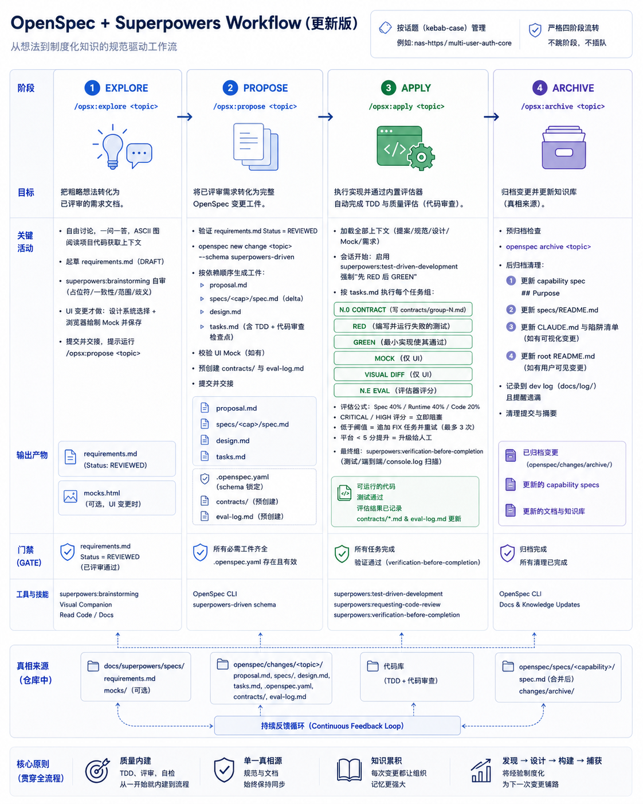
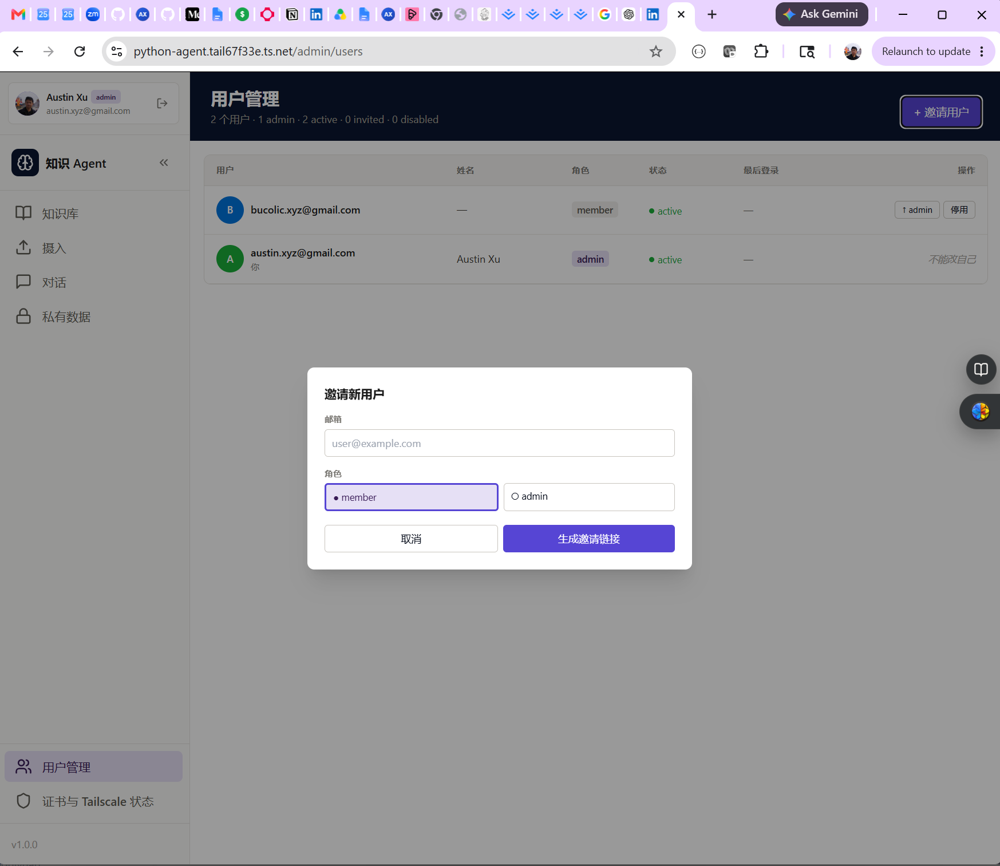

Anthropic's engineering team published [a post on harness design for long-running apps](https://www.anthropic.com/engineering/harness-design-long-running-apps). One line stopped me:

> "Generators self-assess poorly — confident praise even for mediocre output."

I've been running OpenSpec's `apply` phase with a code review skill baked in. It runs in the same agent context as the implementation. The reviewer and the implementer are the same session. I read that line and immediately knew: that's my problem. The reviewer runs inside the same context that just wrote the code. The confidence is real. The bias is invisible.

That was the crack. This post is the fix.

<!--truncate-->

---

## The Gap That Was Already There

In [*Stacking OpenSpec and Superpowers, Three Weeks Later: Five Frictions and a Plugin*](https://austinxyz.github.io/blogs/blog/openspec-superpowers-three-weeks-later), I closed five friction points. One of them — Fix 3 — baked `superpowers:requesting-code-review` directly into every task group inside `/opsx:apply`. Before that, review was something I had to remember to ask for. After Fix 3, it fired automatically.

That was the right move. But it didn't close the underlying problem.

The review ran inside the apply agent's context. That agent had just implemented the feature. It had reasoned through every design decision, written every test, and watched them pass. When it reviewed its own work, it reviewed with full knowledge of what it meant to write. The Anthropic finding is precise here: a generator that self-assesses will confirm its own intent, not catch its own errors.

The symptom in practice: review would come back "no critical or high issues," and I'd merge. Two cases stand out where the review was technically correct and still missed something — because the reviewer shared the implementer's frame. What I needed wasn't a smarter reviewer. I needed a reviewer that didn't know what the implementer intended.

---

## The Harness Design

The fix is structural: move evaluation outside the implementer's context entirely.

The design adds a **per-group harness loop** inside `apply`:

```
Group N:

  [N.0 CONTRACT]
    apply agent writes contracts/group-N.md
    content: spec SHALL statements, runtime test commands, code review points, threshold

  [N.1 RED → N.X GREEN]
    TDD as before

  [N.E EVAL]  ← replaces the old requesting-code-review step
    spawn evaluator subagent — fresh context, haiku model
    context: contract file + spec + design + git diff (group only)
    evaluator:
      1. invoke superpowers:requesting-code-review
      2. run runtime test commands from contract
      3. diff implementation vs spec SHALL statements
      4. aggregate score: Spec (40%) + Runtime (40%) + Code (20%)
      5. write to eval-log.md
      6. return BLOCK | PASS | RETRY

  on RETRY: append FIX tasks, re-run N.E (up to 3 attempts)
  on BLOCK: pause immediately, report to human
```

Three things make this different from the old review step.

**Fresh context.** The evaluator subagent spawns with no knowledge of how the code was written. It reads the contract, reads the spec, reads the diff. That's it. It can't be biased by the implementer's intent because it never saw the implementer's reasoning.

**Explicit contract.** Before implementation starts, the apply agent writes `contracts/group-N.md` — a flat list of what "done" means for that group: which spec SHALL statements apply, which test commands to run, which design decisions to verify. The evaluator reads this contract, not the implementer's memory of the contract.

**Structured scoring.** PASS/FAIL isn't enough. The evaluator returns a score across three dimensions with defined weights. BLOCK fires if any CRITICAL or HIGH code finding appears, regardless of total score. RETRY fires if the total is below threshold. A score-78 RETRY is different from a score-55 RETRY — the signal is proportional to the problem.



---

## What Actually Happened

I ran this on [python-agent](https://github.com/austinxyz/python-agent)'s `multi-user-auth-admin-ui` change: an admin UI for managing users — invite, disable, re-enable, delete, with a type-to-confirm gate. Eight groups. Seventy-two tasks. Eight evaluator runs.



Average score: **98.3**. Six groups passed on the first attempt. Two needed one retry each.

The retry that mattered was Group 3.

Group 3 covered the Pinia store — the frontend state layer that calls backend API endpoints. The evaluator came back with score 78, status RETRY, and this finding:

> "HIGH SEVERITY — all 5 actions call endpoints without /api prefix (e.g. `/admin/users` instead of `/api/admin/users`). Backend route is `/api/admin/users`. Mocked tests pass but real API calls will 404."

The tests passed. All seven of them. Because Axios was mocked, and mocked tests don't validate the actual path. The implementer's review had confirmed the test suite was green. The evaluator — reading the contract, reading the spec, checking against the actual backend route — caught what the implementer couldn't see from inside.

Without the harness, that store would have merged. Every API call from the admin UI would have silently 404'd in production.

The other finding came from the code review dimension of Group 2. The evaluator flagged that `invite` was constructing the invitation URL using `request.host_url` — the API server's host. On my NAS setup, the API runs on a different port than the web UI. Every invitation link sent to a user would have included the wrong port. The fix: use an `APP_BASE_URL` environment variable. A self-review would have seen the code, seen that it worked in testing, and moved on. The evaluator, reading only the contract and the spec, saw that the approach was wrong for the deployment target.

Eight groups. Ninety-nine new tests added. Two HIGH issues caught by an evaluator that had no idea I thought the code was done.

The full eval log is [here](https://github.com/austinxyz/python-agent/blob/master/openspec/changes/archive/2026-05-26-multi-user-auth-admin-ui/eval-log.md).

---

## The Cost Model

Adding an evaluator means adding tokens. The actual numbers from this run:

- Total tokens: **~58M**
- Cache hits: **~56M** (96%)
- Evaluator model: **haiku**

The evaluator context is small by design. It sees the contract file, the relevant spec sections, the design doc, and the git diff for that group only — not the apply agent's conversation history. Small context + haiku model = cheap per run. Worst case for a single group is three evaluator runs; in practice most groups pass on attempt one.

The 96% cache rate is what keeps the overall cost reasonable. The apply agent accumulates context across all eight groups, but most of that context is stable — spec files, design docs, earlier groups' completed work. The haiku evaluator hits the same cached spec on every group eval. Structured documents with low churn are exactly what prompt caching is built for.

---

## What I Stopped Doing

I did the `explore` for this feature sixteen days ago — codebase read, requirements drafted, mock sketched. Then I set it aside. Tonight I ran `/opsx:propose` and `/opsx:apply`, back to back. Eight groups, seventy-two tasks executed. Ninety-nine tests written and passing. Two HIGH issues caught, fixed, and re-evaluated. Final smoke test: invite flow works, confirm flow works, admin UI matches the mock.

I defined the requirements. I ran the smoke test. I did nothing in between.

That's not a story about AI doing everything. It's a story about a workflow that knows what "done" means — because the contract defines it, and the evaluator enforces it, and neither of them needs me watching to do their job.

The earlier versions of this stack required my judgment at the review step. I had to read the diff, decide what mattered, decide if the spec was satisfied. Some of that was discipline. Most of it was compensating for a workflow that couldn't articulate what done meant without my help. The harness doesn't replace that judgment — the contract I write before implementation starts is still judgment. But once the contract exists, the verification loop runs without me.

Human-in-the-loop became: define what done means up front, verify it happened at the end.

---

## Status and Next

The harness validation changes live on the `feat/harness-validation` branch of [opsx-superpowers](https://github.com/austinxyz/opsx-superpowers/tree/feat/harness-validation). The branch is active — I'm running apply on it now, not reporting from a finished result.

If the pattern holds across the next few changes, I'll open a PR to merge into main.

To try it on your own project:

```bash
# Install the harness branch directly
claude --plugin-url https://github.com/austinxyz/opsx-superpowers/tree/feat/harness-validation

# Promote the schema — run from your project root, once per install/upgrade
opsx-install

# Windows (PowerShell): use the ! prefix instead
# ! bash /c/Users/<you>/projects/opsx-superpowers/bin/opsx-install
```

Then run as before: `/opsx:explore` → `/opsx:propose` → `/opsx:apply` → `/opsx:archive`. The contract step fires at the start of each group, the evaluator fires at the end. If a group needs a retry, it retries. If a group hits BLOCK, it pauses and waits. The eval log lands at `openspec/changes/<topic>/eval-log.md` and archives with everything else when `/opsx:archive` runs.

---

## References

**This series:**
- Part 1 — [Claude Code: From Vibe Coding to Spec-Driven Development](https://austinxyz.github.io/blogs/blog/2026/03/06/claude-code-spec-driven-development)
- Part 2 — [Stacking OpenSpec and Superpowers: A Combined SDD Workflow](https://austinxyz.github.io/blogs/blog/openspec-superpowers-combined)
- Part 3 — [Stacking OpenSpec and Superpowers, Three Weeks Later: Five Frictions and a Plugin](https://austinxyz.github.io/blogs/blog/openspec-superpowers-three-weeks-later)

**This post:**
- Anthropic Engineering — [Harness Design for Long-Running Apps](https://www.anthropic.com/engineering/harness-design-long-running-apps)
- Harness validation design doc — [2026-05-25-harness-validation-design.md](https://github.com/austinxyz/opsx-superpowers/blob/feat/harness-validation/docs/superpowers/specs/2026-05-25-harness-validation-design.md)
- Eval log from this run — [multi-user-auth-admin-ui eval-log.md](https://github.com/austinxyz/python-agent/blob/master/openspec/changes/archive/2026-05-26-multi-user-auth-admin-ui/eval-log.md)
- Plugin branch — [feat/harness-validation](https://github.com/austinxyz/opsx-superpowers/tree/feat/harness-validation)
- python-agent project — [github.com/austinxyz/python-agent](https://github.com/austinxyz/python-agent)

---

*The methodology isn't done. It won't be. That's still the point.*
