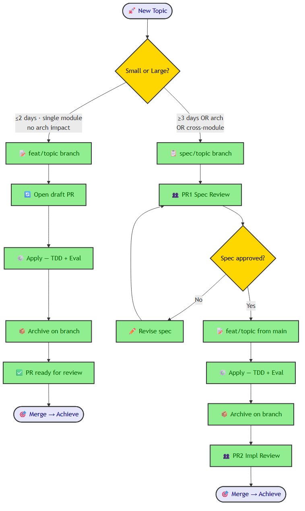
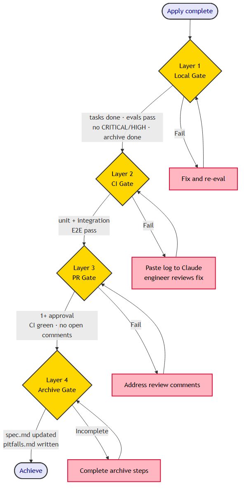
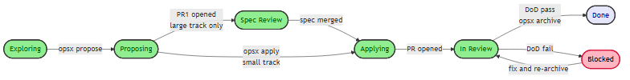

In [*From Cloud Native Apps to AI Native Agent Platforms: The Belts Are the Problem*](https://austinxyz.github.io/blogs/blog/cloud-native-to-ai-native-app-platform), I used the factory electrification story to make an argument about AI platform adoption: factory owners in the 1890s replaced steam engines with electric motors and kept the same belts, shafts, and building layouts. For thirty years, productivity barely moved. The breakthrough came when they reorganized the factory around the new technology — workflow-first, not power-transmission-first.

That post argued at the platform layer: the decisions organizations make about how to architect and run AI-native applications. The electrification analogy there was about keeping the wrong infrastructure assumptions while adopting new technology.

This post is one layer down — the development lifecycle itself. What happens to a team's coordination model when the implementation loop accelerates by an order of magnitude? The same pattern applies: if the team keeps the existing process assumptions while individual engineers adopt AI-accelerated workflows, the system neutralizes the gain.

With OpenSpec + Superpowers + Harness, I've run enough iterations to say the individual story is real. Features that used to take 2-3 days take hours. The workflow knows what done means. I'm not watching in between.

Then someone on the team wanted to use the same workflow. That's when I found out where the bottleneck had moved.

<!--truncate-->

---

## What Changes When Apply Takes Hours

The single-engineer experience: spec carefully, run apply, verify at the end. The harness handles TDD, evaluation, and retries. The loop closes without me.

At team scale, the same acceleration creates a different problem. If every engineer can ship a feature in hours instead of days, more features are in flight simultaneously. That's the opportunity. But parallel development has coordination costs — and those costs don't disappear because implementation got faster. They shift.

The bottleneck isn't implementation speed anymore. It's:

- **Spec quality**: Apply quality equals spec quality. A vague spec that passes eval is a feature that does the wrong thing correctly.
- **PR review bandwidth**: If every engineer opens a PR every day, who reviews them? At what depth?
- **Conflict discovery timing**: Parallel branches that touch overlapping modules conflict at merge time — unless you surface the overlap earlier.
- **Shared file conflicts**: At 2-3 people, parallel archives are fine. At 4-6 people running archives simultaneously, `CLAUDE.md` and `README.md` become a contention point.
- **Architecture coherence**: Who decides module boundaries? What happens when two features make incompatible assumptions about a shared interface?

Each of these is manageable. None of them is solved by the individual workflow alone. The individual workflow tells Claude what done means for a task. The team workflow needs to tell the team what done means for a feature — and prevent parallel work from discovering misalignment too late.

---

## The Branch Model

The design I landed on uses two tracks based on feature scope.



The split exists because spec review and code review are different activities at different stakes. Spec review is high-stakes: if the requirements are wrong, apply produces the wrong thing correctly. Code review after a harness-validated apply is different: CI is green, all evals passed, no unresolved CRITICAL or HIGH findings. The job at PR2 is to verify that Claude implemented the spec's intent — not to re-run quality checks the harness already ran.

**"Large" triggers (any one is enough):**
- Touches interfaces shared by 2+ engineers' active work
- Architectural decision requiring team alignment
- Estimated apply time ≥ 3 days
- Breaking changes to an existing capability spec

**What PR review looks like after harness validation:**

| Check | Source |
|-------|--------|
| CI green (unit + integration + E2E)? | CI dashboard |
| All eval groups pass threshold? | eval-log.md |
| No unresolved CRITICAL/HIGH? | Final evaluator output |
| PR description matches spec intent? | proposal.md |

Don't do line-by-line code review. The harness and CI pipeline are the primary quality gates — more reliable for correctness than manual code inspection. What humans bring to PR review is spec fidelity judgment: did Claude implement what we actually meant, or just what we literally wrote?

---

## Parallel Development Without Merge Surprises

The most expensive conflicts in distributed development aren't merge conflicts in git. They're design conflicts that surface after two weeks of parallel work — when you discover that engineer A's feature assumed an interface engineer B just changed.

The fix is to surface conflicts at **propose time**, not merge time.

During `/opsx:propose <topic-B>`:

```
→ Read openspec/specs/  (all existing capability specs)
→ git branch -r | grep 'feat/\|spec/'  (list active branches)
→ Read proposal.md of each active branch
→ Write in design.md Dependencies section:
    "depends on: topic-A (needs auth interface stable before apply)"
    "conflicts with: none detected"
```

This isn't a sophisticated dependency graph tool — it's a reading task. Claude reads the active branches and the existing specs and declares what it found. If topic-B depends on an interface topic-A is still building, that dependency is visible before apply starts, not after it finishes.

If B depends on A's interface: A's spec PR must merge before B enters apply. Not "can't parallelize" — "interface must lock before parallel implementation starts."

**Two conflict types need different handling:**

*Code conflicts* are normal git work. Rebase and resolve.

*Opinion conflicts* (design disagreements) follow a decision tree: implementation detail disagreements get arbitrated by the evaluator (whichever approach scores higher against the spec), design decisions go into `design.md` Alternatives section for a team sync, requirements interpretation ambiguities return to explore for rewriting. The pattern: make the conflict visible, make the decision explicit, write it down. The spec accumulates decisions. Later engineers — and later Claude apply runs — read from that accumulated context.

---

## The Four-Layer Achieve Gate

Apply finishing is not achievement. The harness tells you the code is right. Achieve tells you the feature is shippable.



The integration tests live in CI by design. Local dev environments typically lack the full service stack — external APIs, multi-container orchestration, seeded database state. Running integration tests locally requires environment parity that isn't worth maintaining. CI has the full environment. That's the explicit trade-off.

One direction worth watching: sandbox environments that give each PR production-like isolation at dev time, before CI. [Signadot](https://www.signadot.com) is building specifically in this space — their focus is the dev-time side, where coding agents are submitting changes and need an isolated environment to validate against. That maps directly onto the Layer 2 gap here: if a sandbox exists per branch, integration tests could run earlier in the loop rather than waiting for CI. Worth exploring as a potential tightening of the achieve gate.

CI failure after a PR opens: engineer pastes the failure log to Claude. Claude fixes on the feature branch, shows the diff, engineer reviews and approves, Claude commits and pushes. Not a full re-apply — just the specific failure. Git history stays clean.

---

## The Integration Layer

The four-layer gate defines what done means. The integration layer makes that visible to the rest of the team — without anyone updating a ticket manually.

Three goals drove the design:
1. **Visibility** — PM sees which OpenSpec phase a ticket is in without asking
2. **Automation** — JIRA status updates happen automatically; zero manual updates
3. **DoD enforcement** — ticket cannot close until eval passes, CI is green, and archive completes

The approach: `opsx` CLI as the integration layer. Each phase command (`opsx explore`, `opsx propose`, `opsx apply`, `opsx archive`) calls a `jira_hook.py` post-step internally. Jenkins is a pure runner — it executes opsx commands. The JIRA integration logic lives in opsx, not in the Jenkinsfile.

This keeps the integration testable locally, consistent across dev and CI, and resilient: JIRA API errors are non-fatal. A JIRA outage never breaks a build.

### JIRA Status Mapping



`jira_key` is optional in `.meta.yaml`. If absent, all hooks skip silently. This supports both directions: PM creates a ticket first, or engineer starts an explore and links a ticket later.

### Jenkins: Where Each Phase Runs

`explore` and `propose` run locally — they're interactive conversations with Claude. `apply` can run on Jenkins (feat/* branch) or locally. `archive` runs on Jenkins post-merge to enforce DoD.

```groovy
stage('apply') {
  when { branch 'feat/*' }
  steps { sh 'opsx apply $TOPIC' }
}
stage('test') {
  steps {
    sh 'make test'   // unit + integration
    sh 'make e2e'    // E2E (CD pipeline)
  }
}
stage('archive') {
  when { branch 'main' }
  steps { sh 'opsx archive $TOPIC' }
}
```

`TOPIC` is derived from the branch name automatically (`feat/auth-refactor` → `auth-refactor`).

### DoD Enforcement at Archive

Before `opsx archive` transitions a ticket to Done, it runs four checks:

| Check | Pass condition |
|---|---|
| eval-log.md | No CRITICAL or HIGH findings |
| CI green | Build passed |
| PR merged | On main branch |
| Archive files | pitfalls.md exists + spec.md has DONE status |

Any failure transitions the ticket to **Blocked** instead, adds a comment explaining which check failed, and exits 1 — Jenkins stage fails. MEDIUM and LOW findings are warnings only.

The result: a ticket that reaches Done in JIRA is a ticket where the harness validated the code, CI passed, a human reviewed and approved, and the knowledge was archived. Not as a checklist someone filled out — as a gate that ran automatically.

---

## What Engineers Do Now

The harness changed the individual loop. The team workflow changes the engineer's role.

With apply handling TDD, evaluation, and retries automatically, engineering time shifts from execution to judgment.

| Before | After |
|--------|-------|
| Implementation is core work | Spec authorship is core work |
| Senior engineer = fastest coder | Senior engineer = sharpest spec author + architecture thinker |
| Bottleneck = implementation speed | Bottleneck = PR review bandwidth + spec quality |
| Feature takes 2-3 days | Feature takes hours; more run in parallel |

**Spec authorship is the highest-leverage activity.** Thirty minutes of precise spec writing produces three hours of clean apply. Vague specs produce passing evals that miss intent — technically correct results that do the wrong thing. Engineers become requirements translators: converting product intent into SHALL statements Claude can execute precisely.

**Spec fidelity review replaces code review.** At PR time, the questions are:
- Did Claude implement the spec's intent, or just its literal wording?
- Did eval pass because the spec was good, or because it was too vague to fail?
- Are edge cases captured in the spec, or silently absent?

**Architecture judgment stays human.** Who writes `spec/arch-<name>`? Who decomposes sub-topics? Who defines module boundaries? Who decides what an interface contract looks like? These require understanding of where the system is going — Claude cannot make these decisions. They require engineers who have thought about the system's evolution, not just its current state.

The engineer's job became: decide what to build, define what done means, verify AI built it correctly. Only the head and the tail. The middle runs on its own.

---

## Scaling Past Three People

At 2-3 people, shared files are rarely a problem. At 4-6 people running parallel archives, `CLAUDE.md`, `openspec/specs/README.md`, and `openspec/config.yaml` become merge conflict sources.

The fix: archive only ever touches per-capability files.

```
CLAUDE.md                  ← short, stable index. NOT updated at archive time.
openspec/specs/README.md   ← updated only when a new capability is created
                              (happens in spec PR, not at archive)
openspec/config.yaml       ← changes through a dedicated chore PR, not tied to features

openspec/specs/<capability>/spec.md      ← updated at every archive of this capability
openspec/specs/<capability>/pitfalls.md  ← updated at every archive of this capability
```

Different capabilities = different files = parallel archives never conflict. Six engineers can archive simultaneously without touching the same file.

`CLAUDE.md` becomes a short, stable index:

```markdown
## Capability Pitfalls
Read the relevant file during apply:
- auth: openspec/specs/auth/pitfalls.md
- payment: openspec/specs/payment/pitfalls.md
- notifications: openspec/specs/notifications/pitfalls.md

## Global Pitfalls
[Cross-cutting pitfalls only. Keep < 5 entries.]
```

Most pitfalls have a capability home and go directly to per-capability files at archive time. The Global section grows slowly. This is what prevents the `CLAUDE.md` sprawl that makes long-running projects hard to navigate.

---

## The Multiplier

Individual AI tools gave one developer a productivity multiplier. The implementation loop got shorter. The bottleneck moved.

A team that restructures around the new constraint gets a multiplier on that multiplier. Not because AI does more things — because engineering time concentrates where it creates the most leverage: spec precision, architecture coherence, accumulated knowledge in `openspec/specs/`.

The risk is getting the workflow wrong. AI-accelerated implementation with poor spec discipline produces the wrong things, quickly. The harness catches implementation errors. It cannot catch spec errors. That's the engineer's job, and it requires investing in it intentionally.

Done well: the team delivers more, the knowledge base grows with every archive, and the work that requires human judgment — deciding what to build, defining what done means, verifying it happened — is where engineering time actually goes.

One engineer with this stack might see a 10x productivity multiplier. A team that gets the workflow right gets a multiplier on that multiplier. If the team gets it wrong, the acceleration works against them.

---

## References

**This series:**
- Part 1 — [Claude Code: From Vibe Coding to Spec-Driven Development](https://austinxyz.github.io/blogs/blog/2026/03/06/claude-code-spec-driven-development)
- Part 2 — [Stacking OpenSpec and Superpowers: A Combined SDD Workflow](https://austinxyz.github.io/blogs/blog/openspec-superpowers-combined)
- Part 3 — [Stacking OpenSpec and Superpowers, Three Weeks Later: Five Frictions and a Plugin](https://austinxyz.github.io/blogs/blog/openspec-superpowers-three-weeks-later)
- Part 4 — [Stacking OpenSpec and Superpowers, Then I Added a Harness](https://austinxyz.github.io/blogs/blog/openspec-superpowers-harness)

**This post:**
- Multi-engineer workflow design — [2026-05-26-multi-engineer-workflow-design.md](https://github.com/austinxyz/opsx-superpowers/blob/feat/harness-validation/docs/superpowers/specs/2026-05-26-multi-engineer-workflow-design.md)
- CI/CD + JIRA + Jenkins integration design — [2026-05-26-cicd-jira-integration-design.md](https://github.com/austinxyz/opsx-superpowers/blob/feat/harness-validation/docs/superpowers/specs/2026-05-26-cicd-jira-integration-design.md)
- Slides — [OpenSpec + Harness: Multi-Engineer Workflow](https://austinxyz.github.io/opsx-superpowers/slides/en/)
- Signadot — [Agent Sandboxes for Dev-Time Isolation](https://www.signadot.com)

---

*The methodology isn't done. It won't be. That's still the point.*
