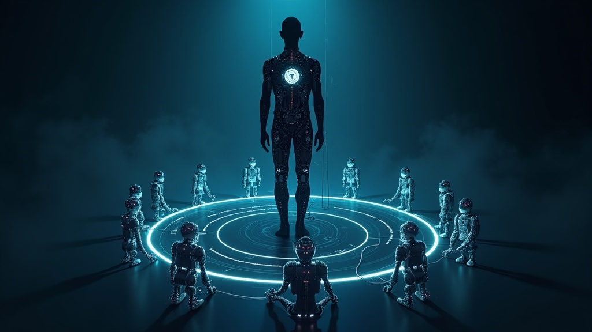

Gartner recorded a [1,445% increase in multi-agent consulting requests](https://beam.ai/agentic-insights/multi-agent-orchestration-patterns-production) last year. In the same period, 40% of multi-agent pilots died within six months.

That gap is the thing worth understanding.

I've been building with agents long enough to know that most framework selection conversations start in the wrong place. Engineers ask "which framework?" when the prior question — do we need multi-agent at all? — hasn't been answered. The data on that prior question is more interesting than most of the framework benchmarks.

<!--truncate-->

## The Case Against Multi-Agent (Before You Pick a Framework)

Princeton NLP ran 200 tasks across single-agent and multi-agent setups and found something the framework vendors don't headline: [a single agent doesn't lose to multi-agent systems on 64% of tasks](https://beam.ai/agentic-insights/multi-agent-orchestration-patterns-production), and it costs roughly half as much.

This doesn't mean multi-agent is wrong. It means multi-agent is a resource allocation decision, not a capability upgrade. You add agents when a single context window isn't enough, or when attention dilutes across a 50-step task. Those are real problems. But they're not the default problem. If you're reaching for AutoGen because "multi-agent is more powerful," you're probably making your system more expensive and harder to debug for no architectural reason.

The question before framework selection: what specifically breaks with a single agent on this task? If the answer is "nothing in particular," you don't need multiple agents.

## What the Benchmark Numbers Say

Once you've decided multi-agent is actually necessary, the framework comparison looks like this:

LangGraph, AutoGen, and CrewAI are the three most deployed open frameworks. On a [standardized 200-task benchmark using Qwen3 32B](https://pooyagolchian.com/blog/crewai-vs-langgraph-autogen-comparison-2026/), LangGraph scores 62%, AutoGen 58%, CrewAI 54%. The performance differences are real but not dramatic.

Download numbers tell a different story. LangGraph pulls 34.5 million downloads per month; CrewAI sits at 5.2 million. That gap isn't explained by the benchmark difference alone — it reflects ecosystem maturity, tooling, and community support that compounds over time.

AutoGen itself is in transition. Microsoft put it into maintenance mode earlier this year and is consolidating it into Microsoft Agent Framework, which went GA in April 2026. If you're making a long-term framework bet, this matters. A maintained framework is worth more than a slightly better benchmark number.

I've worked with LangGraph directly. I wrote about the experience of building agents from scratch with it — the graph abstraction maps cleanly onto how real agent workflows actually behave, with state flowing through nodes rather than sequential function calls. That model clicks once you internalize it. It doesn't feel like a framework so much as a notation system for agent behavior.

## Orchestration vs. Choreography

The more important decision than which framework is which coordination pattern inside the framework. There are six production patterns worth knowing:

**Orchestrator-worker** (a central agent delegates to specialized subagents) [saves 40-60% on cost](https://beam.ai/agentic-insights/multi-agent-orchestration-patterns-production) versus ad-hoc coordination. It's the right pattern when tasks are decomposable and the orchestrator can plan the full sequence upfront.

**Pipeline** (fixed sequence of steps) is the most efficient when the workflow is deterministic. The failure mode is using it for dynamic tasks — pipeline mismatch produces 3× overhead compared to adaptive approaches.

**Fan-out** (one task splits into parallel subtasks, then merges) cuts wall-clock time by up to 75% when subtasks are independent. The hidden cost is the merge step — if aggregating results requires significant reasoning, the savings shrink.

**Adaptive planning**, **dynamic handoff**, and **hierarchical** variants all trade some efficiency for flexibility. They're right when the task structure isn't known in advance.

Mixed architectures — orchestrator-worker at the top, pipeline inside each worker — are the practical consensus for production systems. Pure patterns are clean in theory; real workflows require composition. The uncomfortable part: you usually don't know which pattern you need until you've broken the wrong one. Tasks that look fully decomposable upfront have a habit of developing order dependencies at step 8 that the orchestrator didn't anticipate. The pattern documentation doesn't tell you this. Production debugging does.

## A Fourth Category: When the Framework Bundles the Runtime

While the open-framework conversation has centered on LangGraph, CrewAI, and AutoGen's successor, two cloud providers shipped something structurally different in 2025–2026: frameworks that bundle the runtime layer directly.

[AWS Strands Agents](https://strandsagents.com) reached stable in July 2025 and has accumulated over 14 million downloads. The design philosophy is different from LangGraph: instead of an explicit state graph you define, the LLM autonomously chains reasoning steps using the ReAct pattern. You provide a system prompt and tools; the model decides how to sequence them. The deploy target is Lambda and Bedrock AgentCore, and it's not experimental — Amazon Q Developer and AWS Glue already run on it.

[Google ADK](https://google.github.io/adk-docs/) (Agent Development Kit) shipped in April 2026, taking a more graph-structured approach closer to LangGraph, but with native A2A protocol support and natural deployment to Vertex AI and Cloud Run.

What makes these different from the open frameworks isn't the orchestration logic — it's that the runtime infrastructure comes with them. When you pick Strands, you're not choosing a framework and then separately designing a harness. AWS is making that harness decision for you, optimized for their compute stack.

This collapses a decision point. The tradeoff is the obvious one: you get an optimized, maintained harness for free, and you accept meaningful vendor lock-in. If you're already committed to AWS or GCP, that's a reasonable exchange. If you're not, you're now making a cloud commitment through your framework selection, which is a different kind of decision than choosing between LangGraph and CrewAI.

The broader point: framework selection in 2026 isn't just about orchestration patterns. It increasingly determines where your agents run and who optimizes the cost.

## The Variable Most Teams Underestimate: The Harness

Here's the number that changed how I think about agent costs.

[Databricks benchmarked](https://www.theregister.com/ai-and-ml/2026/07/13/the-price-is-wrong-ai-cost-calculation-has-to-consider-task-completion-rates-not-just-token-costs/5270683) three different agent harnesses on identical coding tasks. Same model. Same task. Different harness:

- Pi: 237,000 tokens per task
- Claude Code: 742,000 tokens per task
- Codex: 1,235,000 tokens per task

That's a 5× range on token consumption for the same work. The harness — the runtime layer that manages context, memory, tool calls, and state — contributes more to your cost than the model pricing tier in many scenarios.

The standard cost conversation focuses on model selection. "Sonnet is cheaper than Opus, so use Sonnet." But if your harness is inefficient with context, you can be spending more with a cheaper model than a competitor using a more expensive model in a leaner harness. The unit that matters is cost per completed task, not cost per token.

Gen 3 harnesses are starting to show what this looks like when taken seriously. [Hermes Agent](https://github.com/nousresearch/hermes-agent), from NousResearch, was released this year and hit 216K GitHub stars. Its design premise is a "self-improving agent" — after completing complex tasks, it generates skill files that it then evolves using GEPA (Genetic-Pareto Prompt Evolution). The optimization process costs $2-10 per run in API calls, with no GPU training required. The system reads execution traces to understand *why* things failed — not just that they failed — and proposes targeted prompt improvements. ICLR 2026 accepted this as an oral paper.

[OpenClaw](https://clawbot.ai), built by an Austrian developer and grown to 250,000 stars in roughly 60 days, takes a different angle. It's a self-hosted agent runtime with a Heartbeat Daemon that wakes on a configured interval, reads a local instruction file, and decides whether to act — without any user prompt. The framing that stuck with me from analysis of its architecture: "it feels like AGI not because the model suddenly became all-powerful, but because systems engineering amplifies what the model can execute." The model handles reasoning and decisions. The harness handles execution infrastructure. The perceived autonomy comes from engineering design, not model capability.

Neither of these is a framework competitor to LangGraph. They're a different layer: the harness that sits above the framework, managing how the framework gets invoked, how state persists, and how costs accumulate. Most teams working on agent systems today haven't started thinking about harness design as a separate discipline. The Databricks numbers suggest they should.

## The Decision

If someone asked me which framework to use, I'd ask two questions before answering.

First: can the task be decomposed upfront, or does the structure only become clear mid-execution? That question determines your coordination pattern — and your coordination pattern matters more than your framework choice. Get the pattern wrong and the framework can't save you.

Second: are you inside an existing ecosystem? If you're Microsoft-stack, Microsoft Agent Framework is where AutoGen is heading, and the enterprise support resolves the decision. If you're AWS-committed, Strands is already running at Amazon scale and the harness decision is made for you.

If neither constraint applies: LangGraph. The graph abstraction costs you upfront modeling time — you have to reason about workflow structure before you can implement it — but that cost pays back when something breaks at step 14 and you actually need to trace it. CrewAI starts faster and benchmarks lower; that tradeoff makes sense for prototyping, less so for production systems where you'll be debugging failures you didn't anticipate.

And underneath all of it: what's your harness strategy? Are you tracking cost per completed task? Are you managing context efficiently enough that the model capability can actually express itself? A team that builds a 237K-token harness on top of a more expensive model will consistently outperform a team running 1.235M tokens through a cheaper one.

The framework isn't the ceiling. The harness is.

---

## References

1. Beam.ai — [Multi-Agent Orchestration Patterns in Production](https://beam.ai/agentic-insights/multi-agent-orchestration-patterns-production) — Gartner 1,445% stat, Princeton NLP 64% finding, six production patterns and cost data
2. Pooya Golchian — [CrewAI vs LangGraph vs AutoGen Comparison 2026](https://pooyagolchian.com/blog/crewai-vs-langgraph-autogen-comparison-2026/) — LangGraph/AutoGen/CrewAI benchmark (Qwen3 32B, 200 tasks), download stats
3. The Register / Thomas Claburn — [The price is wrong: AI cost calculation has to consider task completion rates, not just token costs](https://www.theregister.com/ai-and-ml/2026/07/13/the-price-is-wrong-ai-cost-calculation-has-to-consider-task-completion-rates-not-just-token-costs/5270683) — Databricks harness benchmark (Pi / Claude Code / Codex token counts)
4. NousResearch — [Hermes Agent](https://github.com/nousresearch/hermes-agent) — Gen 3 self-evolving agent harness, ICLR 2026 Oral
5. clawbot.ai — [OpenClaw](https://clawbot.ai) — OpenClaw harness architecture
6. Strands Agents — [strandsagents.com](https://strandsagents.com) — official AWS Strands Agents site
7. Google — [Agent Development Kit (ADK) Documentation](https://google.github.io/adk-docs/) — official ADK docs
