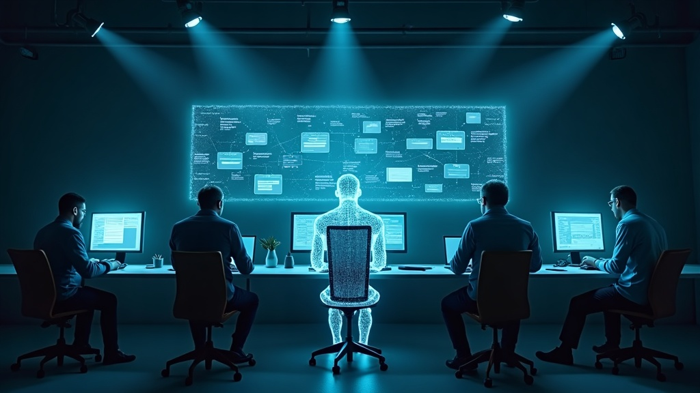

Claude Tag has been the AI story lately. Anthropic gave Claude a persistent identity inside Slack — its own account, its own memory of what a channel cares about, the ability to notice a problem and start fixing it without anyone asking. Andrej Karpathy called it the third major redesign of LLM UI/UX: first the LLM was a website you visited, then an app you downloaded, now [a persistent, asynchronous entity with org-wide tools and context, working alongside a team of humans](https://x.com/karpathy/status/2069547676849557725).

I've been writing about a version of this problem for months. In [*OpenSpec + Harness, Then We Added Engineers*](https://austinxyz.github.io/blogs/blog/openspec-harness-team-workflow), I described what breaks when individual AI acceleration hits a team: spec quality becomes the bottleneck, PR review bandwidth becomes the bottleneck, shared files become a contention point. Claude Tag is the next stop on that same line. It just takes a different road than the one I built.

One engineer running Claude Code well is not the finish line. What's still unsolved is how a group of people use it together. Individual output is up. Team-level delivery time hasn't made the same jump. That gap is what the next round of Harness Engineering has to close.

<!--truncate-->

## Channel Membership vs. Process Definition

Claude Tag's answer is to drop the agent straight into the team's existing collaboration surface. It becomes a member of the channel. It sees what people discuss, gets @-mentioned when needed, and can pick up work someone else already started.

My own approach goes the other way. OpenSpec + Superpowers doesn't turn the agent into a team member. It defines a process and has the agent execute it precisely — how requirements get written, how work gets broken into tasks, how it gets verified. I've since extended that same process to the team layer: how it plugs into source control, how it integrates with CI/CD, how evaluation and quality gates get defined.

| | Claude Tag (channel membership) | OpenSpec + Superpowers (process definition) |
|---|---|---|
| What the agent adapts to | The team's existing habits | A newly defined process |
| Onboarding cost | Low — no workflow change required | Higher — team has to adopt the process |
| Control | Agent judges what to do next | Every step has a defined output and acceptance bar |
| What's left unsolved | A pile of unspecified collaboration details | Whether the team is willing to change habits |

Neither is free. Channel membership pushes the cost into ambiguity, a long list of collaboration edge cases nobody wrote down. Process definition pushes the cost into adoption, whether people are willing to work a new way.

## Where It Actually Gets Hard

I read Claude Tag's material carefully. Some questions had answers. Most didn't. Here's where I landed after checking against Anthropic's official docs.

### Local Development vs. Channel Coordination

Someone's coding locally with Claude Code while Tag is in the channel triaging a bug and prepping a fix PR. How do the two not collide?

There's a documented case: someone flags a bug in Slack, Tag investigates across Datadog, Linear, and GitHub, confirms it's real, and opens a fix PR. Checking the docs, this isn't a one-off. Tag uses the same branch-and-PR mechanics as Claude Code, under its own identity, the Claude GitHub App, not a borrowed human account. That identity design is what settles the "whose permissions is this running under" question.

Whether two humans can develop the same code locally at the same time isn't addressed anywhere. No explicit conflict protocol exists. My own take: allow it, but align on stage-gated deliverables instead of banning parallel local work.

### Multiple Threads, One Channel

A channel can have several efforts running at once, each its own sub-group talking to Tag. Do the threads step on each other?

Here the docs actually answer it. Tag's memory has three layers — thread context for the current task, isolated, and channel memory for the channel's standing rules and decisions, shared. Digging further, the isolation is stricter than I assumed: two threads in the same channel run as two fully separate sessions, each in its own sandbox, with no shared runtime state. The memory layer decides what context loads. The session layer decides how runtime is isolated. Both together is the full answer.

I buy the design. I haven't seen it validated at scale. The docs don't state a concurrency ceiling, and ten threads in one channel versus two could behave very differently. Cache hit rates in collaborative settings are already low. More threads likely makes that worse, not better.

### Does Context Explode?

More conversation accumulates more state. When does it get cleared?

I got this one wrong on my first pass. I'd attributed a distillation mechanism to Claude Tag, turning specific events into generalizable lessons. Turns out that belongs to a different Anthropic product, Claude Managed Agents, not Claude Tag.

Claude Tag's actual answer is plainer. In Anthropic's own words, its memory is a curated note, not a transcript. It accumulates three ways: things a user explicitly asks it to remember, facts it decides on its own are worth keeping, and on-demand reads of past sessions with no full-text search. Nothing gets automatically abstracted into a lesson. What stays is a matter of filtering, not distillation.

That's a more conservative answer than I expected, and the risk shifts with it. It's not about losing detail through abstraction. It's about who decides what the note keeps and what it drops. Right now that judgment call belongs entirely to the model, with no human review layer, which makes drift hard to catch.

### My Own Judgment: Channel Coordinates, Local Executes

The collaboration channel should own handoff and confirmation of staged deliverables. The actual writing and rewriting happens locally, in Claude Code. The channel isn't where development happens. It's where handoffs happen.

Neither source article states this outright, but the docs backed the judgment up, more directly than I expected. Anthropic's own framing: team work goes to Claude Tag, individual work goes to Cowork or Claude Code. Two clearly separated paths, not a layering I invented myself.

Claude Code is built as a single-user tool, a human has to assemble context before handing it a task. Claude Tag lives inside team context by default, exactly the layer Code doesn't cover. The two aren't competing. Splitting work between them lines up with what each one is actually built for.

### Where Should Shared Context Live?

My instinct was that shared team context belongs in GitHub, version history built in, changes traceable at a glance.

Anthropic didn't go that way. Their own account: they tried a number of memory approaches and landed on something closer to a plain filesystem, a space the model can read and write to over time and maintain itself. Not a versioned repo. A living store.

The trade-off is clear once you see it. GitHub buys traceability and rollback at the cost of routing every read and write through version control. A plain filesystem buys flexibility and low friction at the cost of having no built-in history to check when something goes wrong.

### Versioning, Release, Rollback

Does agent-produced work go through a release process? Can you roll back to before the agent touched it?

Neither source article touches this. The docs filled the gap. Code has no Tag-specific rollback system, it's a standard PR, and if something's wrong you revert through git history, same as human-written code. Memory can be edited or forgotten by asking Tag directly, but that's memory management, not source versioning. Different problem entirely.

Code's answer is solved already, nothing to invent. Memory is where the real gap is: an edited or forgotten note has no version history to check against. Neither source article raises it.

### How Many Layers Should CLAUDE.md Have?

CLAUDE.md today is a single project's constitution, coding standards, architectural principles, tool usage, scoped to one repo.

That layer stops being enough once teams collaborate through an agent. The channel itself needs rules: who files work, when Tag should just run with something versus wait for a human, where cross-project conventions live. None of that belongs to any one project. It belongs to collaboration itself.

My instinct is two layers. The project layer stays what it is today. The collaboration layer needs its own file: how this team, this channel, works with the agent, who owns what, what triggers an escalation to a human, where shared-across-projects conventions live, so they don't get copy-pasted into every project's CLAUDE.md.

Neither source raised this, and the docs gave a clearer answer than I expected: no such file exists. Anthropic's own guidance actively discourages it. Long playbooks shouldn't live in memory at all, they belong in a repo Tag can read, not repeated inside memory. Governance runs through admin-configured Access bundles, scoping tools, repos, and instructions, plus whatever channel memory accumulates. No single constitution for collaboration exists.

That's a real break from the CLAUDE.md convention Claude Code trained me on, one project, one constitution. At the team-collaboration layer, that pattern currently has no counterpart. I think that's a genuine gap, not something I'm inventing.

## What's Still Unsolved

Checked against Anthropic's docs, here's where things actually stand:

- **Local + channel collision** — identity and permissions are solved; simultaneous local edits to the same code are not
- **Thread isolation at scale** — sound in design, unvalidated past a handful of concurrent threads
- **Memory curation** — no human review layer over what gets kept or dropped
- **Memory versioning** — editable and forgettable, but with no rollback history
- **A collaboration-layer constitution** — explicitly discouraged by Anthropic, with no replacement offered
- **Role definition inside a channel** — see below

## AI-Driven Team Collaboration Still Has No Standard Answer

Claude Tag's answer is to fold the agent into the team's existing way of working. Mine is to have the agent follow a newly defined process. Which one gets there first, I can't say yet.

But underneath those questions, something more fundamental is shifting. AI lets everyone act like a one-person team, a single person can now take something from idea to done without waiting on anyone else. That's a real gain, and it comes with a cost: the bar for collaboration just went up. Disagreements used to force either compromise or a standoff. Now there's a third, cheaper option, each side just has an AI do it their way, no alignment required. The friction doesn't disappear. It just moves downstream, to whenever the branches have to merge, and it's more expensive by the time it shows up.

Neither channel membership nor process definition answers this directly. Who has the authority to call a direction when people disagree, whose judgment outranks whose, whether a solo-built branch needs review before it merges, these are role questions, not identity questions. Claude Tag's Access bundles govern which tools and repos someone can touch. They say nothing about whose call it is. Nothing productized addresses this layer yet.

My own answer: a channel needs an explicit lead, not one that emerges from seniority or who talks loudest. It has to be written into the collaboration layer's rules. This isn't new to me. It's the same shape as incident command in SRE, anyone can act during an incident, but one person's call is final, and that's what keeps a room full of capable people from working against each other. A channel needs the same thing. Escalate disagreements to the lead. Route merges through the lead. Without both, collaboration doesn't fail loudly. It just quietly fragments into a pile of people running their own AI in their own direction.

But the next stage of Harness Engineering isn't about whether an agent can do the work anymore. It's about how a group of agents and a group of people work together. That's where the actual productivity gain is sitting, unclaimed.

## References

1. [Andrej Karpathy on the third redesign of LLM UI/UX](https://x.com/karpathy/status/2069547676849557725) — X post
2. [Introducing Claude Tag](https://www.anthropic.com/news/introducing-claude-tag) — Anthropic's announcement
3. [Claude Tag product page](https://claude.com/product/tag)
4. [Work with Claude Tag](https://claude.com/docs/claude-tag/overview) — official docs
5. [How Claude Tag works](https://claude.com/docs/claude-tag/concepts/how-it-works) — thread/session/sandbox isolation
6. [What Claude Tag remembers](https://claude.com/docs/claude-tag/users/memory) — memory mechanics
7. [Set up Claude Tag](https://claude.com/docs/claude-tag/admins/setup-overview) — access requirements, Access bundles
8. [What is Claude Tag?](https://support.claude.com/en/articles/15594475-what-is-claude-tag) — help center
9. [OpenSpec + Harness, Then We Added Engineers](https://austinxyz.github.io/blogs/blog/openspec-harness-team-workflow) — the prior post this one extends
